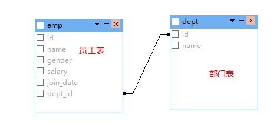
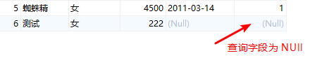
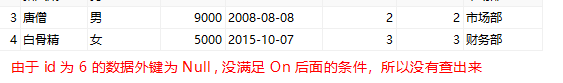
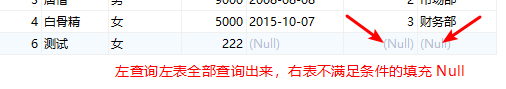
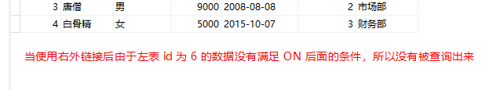
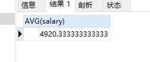
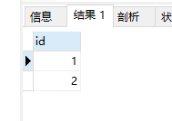

# Mysql

## DML：增删改表中的数据

### 1. 添加
- 语法
  ``` sql
  insert into 表名 (列名1, 列名2, ...列名n) values(值1, 值2, ...值n)
  ```
- 示例
  ``` sql
  -- 基本
  INSERT INTO `user` ( `name`, age, sex ) VALUES('张三', 22, '男')

  -- 去掉列名
  INSERT INTO `user` VALUES(DEFAULT, '张三', 22, '男')

  -- 添加多个
  INSERT INTO `user` VALUES
  (NULL, '张三', 22, '男'), 
  (NULL, '李四', 23, '女'),
  (NULL, '王五', 24, '男')
  ```
- 注意
  1. 列名和值要一一对应
  2. 如果表名后，不定义列名，则默认给所有列添加值，`ID`自增的话可以用`default`或者`null`，但不能不写
  3. 处理数字类型，其他的类型用双引号包起来

<hr>

### 2. 修改
- 语法
  ``` sql
  update 表名 set 列名1 = 值1, 列名2 = 值2, 列名三 = 值3, ... [where 条件]
  ```
- 示例
  ``` sql
  -- 基本
  UPDATE `user` SET `name` = 'jack', age = 24 WHERE id = 16

  -- 不加 where 条件会修改全部数据
  UPDATE `user` SET sex = '男'
  ```
- 注意
  1. 如果不加任何条件，则会将表中所有记录全部修改。

### 3. 删除
- 语法
  ``` sql
  update from 表名 [where 条件]
  ```
- 示例
  ``` sql
  -- 基本
  DELETE FROM `user` WHERE `name` = 'jack'

  -- 不加 where 条件会删除全部记录
  DELETE FROM `user`

  -- 删除表中所有记录（推荐）
  TRUNCATE TABLE `user`
  ```
- 注意
  1. 如果不加条件，则删除表中所有记录。
  2. 如果真的要删除所有记录
      - `delete from 表名`;     不推荐使用。有多少条记录就会执行多少次删除操作。效率低
      - `truncate table 表明`;  推荐使用，先删除表，然后再创建一张一样的表。效率高

<hr>

## DQL：查询表中的记录

### 1. 语法
  ``` sql
  select
      字段列表
  from
      表名列表
  where
      条件列表
  group by
      分组字段
  having
      分组之后的条件
  order by
      排序
  limit
      分页限定
  ```

### 2. 基础查询
  ``` sql
  -- 1. 多个字段的查询
  SELECT id, `name`, sex from `user`

  -- 2. 用 * 号查询全部字段
  SELECT * FROM `user`

  -- 3. 用 as 起别名，as 也可以省略，字段之间用逗号隔开
  SELECT name AS n, age a, sex AS s FROM `user`

  -- 4. 去除重复
  SELECT DISTINCT age FROM `user`

  -- 5. 四则运算
  SELECT `name`, id + age AS total, id FROM `user`
  ```
  
### 3. 条件查询
  ``` sql
  1. > 、< 、<= 、>= 、= 、<>
    -- 查询 id + age 大于 50 的记录
    SELECT *, id + age as count FROM `user` WHERE id + age > 50
  
  2. between ... and ...
    -- 查询年龄大于等于20并且小于等于30（包含20跟30）
    SELECT * FROM `user` WHERE age >= 20 AND age <= 30
    SELECT * FROM `user` WHERE age BETWEEN 20 AND 30
  
  3. in(集合) 
    -- 查询 age 等于 20、23或者24的记录
    SELECT * FROM `user` WHERE id = 20	OR id = 23 OR id = 24 
    SELECT * FROM `user` WHERE id IN (20, 23, 24)

  4. like：模糊查询
    4.1 '_'：单个任意字符
    -- 第二个字是张并且只有两个字
    SELECT * FROM `user` WHERE `name` LIKE '_张'
    -- 有三个字符
    SELECT * FROM `user` WHERE `name` LIKE '___'
    
    4.2 '%'：多个任意字符
    -- 以张开头
    SELECT * FROM `user` WHERE `name` LIKE '张%'
    -- 以张结尾
    SELECT * FROM `user` WHERE `name` LIKE '%张'
    -- 包含张
    SELECT * FROM `user` WHERE `name` LIKE '%张%'
  
  5. is null
    -- 查询time为null（不能用time=null）
    SELECT * FROM `user` WHERE time IS NULL
    -- 查询不为null
    SELECT * FROM `user` WHERE time IS NOT NULL

  6. and  或  &&
    -- name包含三 并且 sex是男
    SELECT * FROM `user` WHERE `name` LIKE '%三%' AND sex = '男'
  
  7. or   或  || 
    -- age 等于 10 或者 20
    SELECT * FROM `user` WHERE `age` = '10' OR age = '20'

  8. not  或  !
    -- 查询不为null
    SELECT * FROM `user` WHERE time IS NOT NULL
  ```

### 4. 排序查询
- 语法
  ``` sql
  order by 排序字段1 排序方式1, 排序字段2 排序方式2, ...
  ```
- 排序方式
  1. ASC：升序，**默认**
  2. DESC：降序
- 示例
  ``` sql
  -- 升序（默认）
  SELECT * FROM `user` ORDER BY `age`
  SELECT * FROM `user` ORDER BY `age` ASC

  -- 降序
  SELECT * FROM `user` ORDER BY `age` DESC
  
  -- 多个排序（前一个排序条件满足时，再排后一个条件）
  SELECT * FROM `user` ORDER BY `age` ASC, `money` DESC
  ```

### 5. 聚合函数
- 示例（计算列）
  ``` sql
  -- 1. count：计算个数（一般使用主键）
  SELECT COUNT(time) AS count FROM `user`

  -- 2. max：计算最大值
  SELECT MAX(age) FROM `user`

  -- 3. min：计算最小值
  SELECT MIN(age) FROM `user`

  -- 4. sum：计算和
  SELECT SUM(age) FROM `user`

  -- 5. avg：计算平均值
  SELECT AVG(age) FROM `user`
  ```
- 注意
  1. 集合函数会排除`Null`值

### 6. 分组查询
- 语法
  ``` sql
  group by 分组字段
  ```
- 示例
  ``` sql
  -- 按照性别分组。分别查询男、女同学的平均年龄
  SELECT sex, AVG(age) AS avg FROM `user` GROUP BY sex

  -- 按照性别分组。分别查询男、女同学的平均年龄、人数
  SELECT sex, AVG(age) avg, COUNT(id) AS count FROM `user` GROUP BY sex

  -- 按照性别分组。
  -- 分别查询男、女同学的平均年龄、总人数。
  -- 年龄低于22的人，不参与分组
  SELECT sex, AVG(age) avg, COUNT(id) AS count FROM `user` WHERE age > 22 GROUP BY sex

  -- 按照性别分组。
  -- 分别查询男、女同学的平均年龄、总人数。
  -- 年龄低于 23 的人，不参与分组。
  -- 分组之后，人数大于 2 的才显示
  SELECT
    sex,
    AVG( age ) avg,
    COUNT( id ) AS count 
  FROM
    `user`
  WHERE
    age > 23 
  GROUP BY
    sex 
  HAVING  -- 这后面只能放分组字段、聚合函数，不能放其他的字段
    count > 2

  ```
- 注意
  1. `having`后面只能放分组字段、聚合函数

- `where` 和 `having` 的区别？
  1. `where` 在分组之前进行限定，如果不满足条件，则不参与分组。`having`在分组之后进行限定，如果不满足结果，则不会被查询出来
  2. `where` 后不可以跟聚合函数，`having`可以进行聚合函数的判断。

### 7. 分页查询
- 语法
  ``` sql
  limit 开始的索引,每页查询的条数;
  ```
- >公式：开始的索引 = （当前的页码 - 1） * 每页显示的条数
- 示例
  ``` sql
  -- 假设每页显示 4 条
  SELECT * FROM `user` LIMIT 0, 4   -- 第一页（1-1）* 4 = 0
  SELECT * FROM `user` LIMIT 4, 4   -- 第二页（2-1）* 4 = 4
  SELECT * FROM `user` LIMIT 8, 4   -- 第三页（3-1）* 4 = 8
  ```
  <hr>

## 约束

### 1. 非空约束
- `not null`：值不能为`Null`
1. 创建表时添加
  ``` sql
  CREATE TABLE test (
    id INT,
    name VARCHAR(20) NOT NULL
  )
  ```
2. 创建完表后添加
  ``` sql
  alter table test modify age varchar(20) not null 
  ```
3. 删除非空约束
  ``` sql
  alter table test modify age varchar(20)
  ```

### 2. 唯一约束
- `unique`：值不能重复，但是`Null`不包含在内
1. 创建表时添加
  ``` sql
  CREATE TABLE test (
    id INT,
    name VARCHAR(20) unique
  )
  ```
2. 创建完表后添加
  ``` sql
  alter table test modify age varchar(20) unique
  ```
3. 删除唯一约束
  ``` sql
  alter table test drop index age
  ```

### 3. 主键约束
- `primary  key`
  1. 非空且唯一
  2. 一张表只能有一个主键
  3. 主键就是表中记录的唯一标识

1. 创建表时添加
  ``` sql
  CREATE TABLE test (
    id INT PRIMARY KEY,
    name VARCHAR(20)
  )
  ```
2. 创建完表后添加
  ``` sql
  alter table test modify age varchar(20) unique
  ```
3. 删除唯一约束
  ``` sql
  alter table test drop index age
  ```

### 4. 外键约束
- `foreign key`


## 多表查询
- 笛卡儿积
  1. 有两个集合A、B，取这两个集合的所有组成情况
  2. 要完成多表查询，需要用`where`消除无用的数据
- 数据表对应关系
  - `emp` 表的 `dept_id` 外键 `dept` 表的 `id`
  
  
  
### 1. 内链接
- 内连接指的是把表与表之间匹配的数据行查询出来。就是两张表之间数据行匹配时，要同时满足`ON`语句后面的条件才行。

- **1.1  隐式内链接**
::: warning 语法
``` sql
select 
  字段1, 字段2, ... 
from 
  表名1, 表名2, ... 
where 
  条件
```
:::

::: tip 示例
``` sql
SELECT
  t1.*,               -- 字段名
  t2.`name` t2_name   -- 字段名
FROM
  emp t1,   -- 表名
  dept t2   -- 表名
WHERE
  t1.dept_id = t2.id    -- 条件
```
:::


- **1.2 显式内链接**
::: warning 语法
``` sql
select 
  字段1, 字段2, ...
from 
  表名1
inner join
  表名2
on
  条件
```
:::

::: tip 示例
``` sql
SELECT
  t1.*,               -- 字段名
  t2.`name` t2_name   -- 字段名
FROM
  emp t1    -- 表名
INNER JOIN  -- inner 可以省略
  dept t2   -- 表名
ON 
  t1.dept_id = t2.id  -- 条件
```
:::

- **1.3 内链接要点**
  1. 从哪些表中查询数据
  2. 条件是什么
  3. 查询哪些字段
  4. **如果某一条的外键为`Null`的话就会忽略这一条，这时候就需要使用外链接来查询**


### 2. 外链接
- `JOIN`前面的表叫`左表`，后面的表叫`右表`

- **1.1  左外链接**
- 无论是否符合`ON`语句后面的条件都会把**左表的记录全部查询出来**，右边的那张表只匹配符合条件的数据。当左表有数据而右表不满足条件时右表则填充 `Null`

::: warning 语法
``` sql
select 
  字段1, 字段2, ... 
from 
  表名1
left outer join   -- outer可以省略
  表名2
on
  条件
```
:::

::: tip 查询的是左表所有数据以及其右表交集部分。
``` sql
SELECT
  t1.*,               -- 字段名
  t2.`name` t2_name   -- 字段名
FROM
  emp t1   -- 表名
LEFT JOIN
  dept t2   -- 表名
ON
  t1.dept_id = t2.id    -- 条件
```
:::


- **1.2 右外链接**

- 跟左外链接恰好相反，右边的表不管有没有满足`ON`后面的条件都会查询出来
::: warning 语法
``` sql
select 
  字段1, 字段2, ...
from 
  表名1
right outer join  -- outer可以省略
  表名2
on
  条件
```
:::

::: tip 查询的是右表所有数据以及其左表交集部分。
``` sql
SELECT
  t1.*,               -- 字段名
  t2.`name` t2_name   -- 字段名
FROM
  emp t1    -- 表名
RIGHT JOIN
  dept t2   -- 表名
ON
  t1.dept_id = t2.id    -- 条件
```
:::


- **1.3 当查询相同的表时内链接、左外链接和右外链接的一些区别**
- 当查询字段为`Null`时

  
- 内链接（inner join）

  
- 左外链接（left join）

  
- 右外链接（right join）

  


### 3. 子查询
- 概念：查询中嵌套查询，称嵌套查询为子查询。根据子查询返回的结果可分为3钟情况
  1. 子查询的结果是**单行单列**
  2. 子查询的结果是**多行单列**
  3. 子查询的结果是**多行多列**，又叫虚拟表

::: tip 1. 单行单列：查询员工工资小于平均工资的记录
``` sql
-- 1. 查询出来平均数，将这条语句作为子查询
SELECT AVG(salary) FROM emp

-- 使用子查询
SELECT * FROM emp WHERE salary < (SELECT AVG(salary) FROM emp)
```
- 子查询的结果是单行单列的

:::


::: tip 2. 多行单列：查询'财务部'和'市场部'所有的员工信息
``` sql
-- 1. 查询 开发部 和 市场部 的 id
SELECT id FROM dept WHERE `name` = '开发部' OR `name` = '市场部'  -- 1 ，2
-- 2. 将查询出来的 id 作为条件查询员工
SELECT * FROM emp WHERE dept_id = 1 OR dept_id = 2

-- 使用子查询
SELECT 
  * 
FROM 
  emp 
WHERE 
  dept_id 
IN (SELECT id FROM dept WHERE `name` IN('开发部', '市场部'))
```
- 子查询的结果是多行单列的

:::