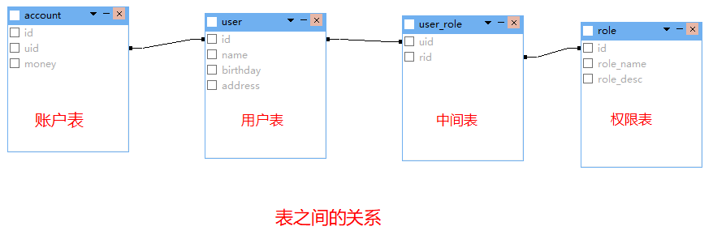
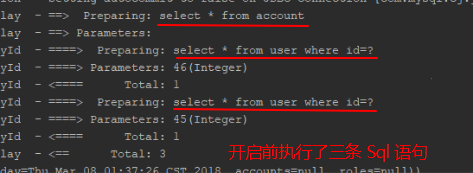
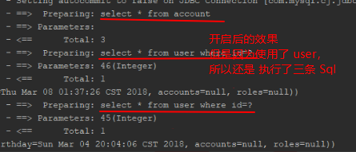
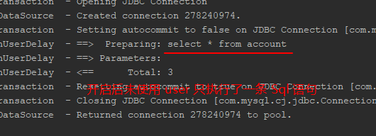

# 基于XML

## 使用步骤
1. Maven 中导入坐标
2. 编写 SqlMapConfig.xml 主配置文件
```xml
<?xml version="1.0" encoding="UTF-8"?>
<!DOCTYPE configuration
        PUBLIC "-//mybatis.org//DTD Config 3.0//EN"
        "http://mybatis.org/dtd/mybatis-3-config.dtd">
<!-- mybatis的主配置文件 -->
<configuration>
    <!-- 配置环境 -->
    <environments default="mysql">
        <!-- 配置mysql的环境-->
        <environment id="mysql">
            <!-- 配置事务的类型-->
            <transactionManager type="JDBC"/>
            <!-- 配置数据源（连接池） -->
            <dataSource type="POOLED">
                <!-- 配置连接数据库的4个基本信息 -->
                <property name="driver" value="com.mysql.cj.jdbc.Driver"/>
                <property name="url" value="jdbc:mysql://localhost:3306/study?serverTimezone=UTC"/>
                <property name="username" value="root"/>
                <property name="password" value="root"/>
            </dataSource>
        </environment>
    </environments>

    <!-- 指定 Dao 对应的 mapper 映射文件的位置 -->
    <mappers>
        <mapper resource="cn/zhugy/mybatis/mapper/IUserMapper.xml"/>
    </mappers>
</configuration>
```
3. 编写 User 实体类
```java
import lombok.Data;
@Data
public class User {
    private Integer id;
    private String name;
    private String address;
}
```
4. 编写 IUserMapper 接口和操作数据库方法
```java
public interface IUserDao {
    List<User> findAll();
}
```
5. 编写 IUserMapper.xml 映射配置文件
```xml
<?xml version="1.0" encoding="UTF-8"?>
<!DOCTYPE mapper
        PUBLIC "-//mybatis.org//DTD Mapper 3.0//EN"
        "http://mybatis.org/dtd/mybatis-3-mapper.dtd">

<!--  Dao 类所在的全限定类名-->
<mapper namespace="cn.zhugy.mybatis.dao.IUserDao">
    <!--  与方法名称，还需要配置返回类型  -->
    <select id="findAll" resultType="cn.zhugy.mybatis.domain.User">
        select * from user
    </select>
</mapper>
```
  
## 在测试类中使用
1. 读取 SqlMapConfig 配置文件
2. 创建 SqlSessionFactoryBuilder 构建对象
3. 使用构建者对象构建出 SqlSessionFactory 工厂对象
4. 使用工厂对象生产 SqlSession 对象
5. 使用 SqlSession 对象创建 Dao 代理对象
6. 使用 Dao 代理对象执行方法
7. 释放资源
```java
// 1. 读取配置文件
InputStream inputStream = Resources.getResourceAsStream("SqlMapConfig.xml");
// 2. 创建 SqlSessionFactoryBuilder 构建对象
SqlSessionFactoryBuilder factoryBuilder = new SqlSessionFactoryBuilder();
// 3. 使用构建对象构建 SqlSessionFactory 工厂对象
SqlSessionFactory factory = factoryBuilder.build(inputStream);
// 4. 使用工厂 SqlSessionFactory 生产 SqlSession 对象
SqlSession sqlSession = factory.openSession();
// 5. 使用 SqlSession 创建 Dao 的代理对象
IUserDao userMapper = sqlSession.getMapper(IUserDao.class);
// 6. 使用代理对象执行接口方法
List<User> list = userMapper.findAll();
for (User user : list) {
    System.out.println(user);
}
// 7. 释放资源
sqlSession.close();
inputStream.close();
```

## 练习

### 查询所有
```xml
<!-- mapper 映射 -->
<select id="findAll" resultType="cn.zhugy.mybatis.domain.User">
    select * from user
</select>
```

### 保存
- 注意：需要提交事务
```xml
<insert id="saveUser" parameterType="cn.zhugy.mybatis.domain.User">
    insert into user (name, birthday, address) values(#{name }, #{birthday}, #{address});
</insert>
```
``` java
// Dao
// 返回影响行数
int addUser(User user)
// 测试
@Test
public void saveUser() {
    User user = new User();
    user.setName("刘备");
    user.setAddress("北京");
    user.setBirthday(new Date());
    int count = userDao.saveUser(user); 
    System.out.println(count);
    sqlSession.commit();    // 提交事务

}
```

### 更新
- 注意：需要提交事务
```xml
<update id="updateUser" parameterType="cn.zhugy.mybatis.domain.User">
    update user set name=#{name}, birthday=#{birthday}, address=#{address} where id=#{id}
</update>
```

### 删除
- 注意：需要提交事务
```xml
<delete id="deleteUser" parameterType="int">
    delete from user where id=#{id}
</delete>
```

### 根据 ID 查询一条
```xml
<select id="findUserById" parameterType="int" resultType="cn.zhugy.mybatis.domain.User">
    select * from user where id=#{id}
</select>
```

### 根据 名称 模糊查询
```xml
<select id="findUserByName" parameterType="String" resultType="cn.zhugy.mybatis.domain.User">
    select * from user where name like #{name};
</select>
```
```java
// 模糊查询这里需要加 %%
List<User> users = userDao.findUserByName("%刘%");
```

### 查询总记录条数
```xml
<select id="findTotalCount" resultType="int">
    select count(id) from user
</select>
```


## 参数讲解

### OGML表达式  
- 通过对象的取值方法来获取数据，在写法上把 get 给省略了
- 例子：获取 name
  - 类写法：user.getName()
  - OGML表达式写法：user.name()
- 因为在 parameterType 中已经提供了属性的所属类，所以可以不用写对象

### 包装对象(QueryVo)  
- 当查询的条件是一个综合条件（除了查用户信息还查账户信息）时，这时候的 parameterType 可以传递包装对象
- 代码示例
```java
// 编写 QueryVo 类
@Data
public class QueryVo {
    private User user;
}

// 编写查询方法
List<User> findUserByVo(QueryVo vo);

// 编写测试方法
@Test
public void testFindByVo(){
    QueryVo vo = new QueryVo();
    User user = new User();
    user.setName("%刘%");
    vo.setUser(user);
    List<User> users = userDao.findUserByVo(vo);
    for(User u : users){
        System.out.println(u);
    }
}
```
```xml
<!-- mapper 映射 -->
<select id="findByMyVo" parameterType="cn.zhugy.mybatis.domain.QueryVo"             resultType="cn.zhugy.mybatis.domain.User">
    select * from user where name like #{user.name}
</select>
```

## 属性跟列名不一致
- 当实体类的属性跟数据库的列名不一致的时候，有两种解决方案
### 起别名
```xml
<!-- 
  role_name：数据库列名
  roleName：实体类属性名
 -->
<select id="findAll" resultType="cn.zhugy.mybatis.domain.Role">
    select id, role_name as roleName, role_desc as RoleDesc from role
</select>
```

### resultMap
```xml
<!-- 
id 标签：用于指定主键字段
result 标签：用于指定非主键字段
column 属性：用于指定数据库列名
property 属性：用于指定实体类属性名称
type属性：实体类
-->
<resultMap id="roleMap" type="cn.zhugy.mybatis.domain.Role">
    <!-- 主键 -->
    <id column="id" property="roleId"/>
    <!-- 其他的属性 -->
    <result column="role_name" property="roleName"/>
    <result column="role_desc" property="roleDesc"/>
</resultMap>

<!-- 这里的 resultType 改为 resultMap 值为上面的 id -->
<select id="findAll" resultMap="roleMap">
    select id, role_name, role_desc from role
</select>
```

## SqlMapConfig.xml 配置
### properties
- 将数据库的配置抽离出来
```properties
<!-- jdbc.properties -->
jdbc.url=jdbc:mysql://127.0.0.1:3306/study?serverTimezone=UTC
jdbc.username=root
jdbc.password=root
jdbc.driver=com.mysql.cj.jdbc.Driver
```
```xml
<!-- SqlMapConfig.xml -->
<!-- 引入配置 -->
<properties  resource="jdbc.properties"/> 
<!-- 使用配置 -->
<dataSource type="POOLED">
    <!-- 配置连接数据库的4个基本信息 -->
    <property name="driver" value="${jdbc.driver}"/>
    <property name="url" value="${jdbc.url}"/>
    <property name="username" value="${jdbc.username}"/>
    <property name="password" value="${jdbc.password}"/>
</dataSource>
```

### typeAliases
- 配置 domain 中实体类的别名
```xml
<!-- SqlMapConfig.xml 中配置 -->
<!--  配置 实体类（domain） 别名  -->
<typeAliases>
    <!-- 单个别名 配置-->
    <typeAlias alias="user" type="cn.zhugy.mybatis.domain.User"/>
    <!-- 整个包配置，扫描整个包下的类别名为类名，使用时不区分大小写-->
    <package name="cn.zhugy.mybatis.domain"/>
</typeAliases>

<!-- IUserMapper.xml 中使用别名 -->
<select id="findAll" resultType="user">
    select * from user
</select>
```
- type：实体类全限定类名
- alias：实体类的别名


### mappers
- 指定 mapper 映射文件的位置
```xml
<mappers>
  <!-- xml 配置 -->
  <mapper resource="cn/zhugy/mybatis/mapper/IRoleMapper.xml"/>
  <!-- 注解 配置 -->
  <!-- 注意：此种方法要求 mapper 接口名称和 mapper 映射文件名称相同，且放在同一个目录中。  -->
  <mapper class="cn.zhugy.mybatis.dao.IAccountDao"/>
  <!-- 扫描整个包 -->
  <!-- 注意：此种方法要求 mapper 接口名称和 mapper 映射文件名称相同，且放在同一个目录中。 -->
  <package name="cn.zhugy.mybatis.dao"/>
</mappers>
```

## 动态 Sql
- 当查询条件不确定时就需要生成动态的 sql 语句
### if
```xml
<!-- 根据传入的参数动态的拼接 sql 语句 -->
<select id="findByCondition" parameterType="user" resultType="user">
    select * from user where 1=1
    <if test="name != null">
        and name = #{name}
    </if>
    <if test="address != null">
        and address = #{address}
    </if>
</select>
```
### where
```xml
<select id="findByCondition" parameterType="user" resultType="user">
<!-- 使用 where 的话 where 1=1 就可以去掉了 -->
    select * from user
    <where>
        <if test="name != null">
            and name = #{name}
        </if>
        <if test="address != null">
            and address = #{address}
        </if>
    </where>
</select>
```
### foreach  
根据 id 集合来查询用户列表，下面 sql 用 mybatis 实现
```sql
SELECT * FROM user WHERE name LIKE '%刘%' AND id IN (48, 52, 53)
```


```xml
<!--  根据包装对象的 id 集合来获取列表  -->
    <!--  根据包装对象的 id 集合来获取列表  -->
<select id="findInIds" parameterType="IdsVo" resultType="user">
    select * from user
    <where>
        <if test="user.name != null">
            and name like #{user.name}
        </if>
        <if test="ids!=null and ids.size()>0">
            <foreach collection="ids" open="and id in(" item="userId" separator="," close=")">
                #{userId}
            </foreach>
        </if>
    </where>
</select>
<!--
collection：集合属性名
open：拼接开始
item：每一项
separator：中间用什么分隔
close：拼接结束
-->
```
```java
// IdsVo
@Data
public class IdsVo {
    private User user;
    private List<Integer> ids;
}

// 测试方法
@Test
public void findInIds() {
    IdsVo idsVo = new IdsVo();
    // 准备 ids 集合
    ArrayList<Integer> list = new ArrayList<Integer>();
    list.add(48);
    list.add(52);
    list.add(53);
    // 准备模糊查询
    User u = new User();
    u.setName("%刘%");

    idsVo.setIds(list);
    idsVo.setUser(u);

    List<User> users = userDao.findInIds(idsVo);
    for (User user : users) {
        System.out.println(user);
    }
}
```

## 多表查询
- 账户表 --> 用户表 一对一（多对一）
- 用户表 --> 账户表 一对多
- 用户表 --> 权限表 多对多



### 一对一（多对一）
- 查询账户时同时查询账户所属用户信息
```java
// 实体类
@Data
public class Account {
    private Integer id;
    private String uid;
    private String money;
    // 一对一
    private User user;
}

public class User {
    private Integer id;
    private String name;
    private String address;
    private Date birthday;
    // 一对多 集合
    List<Account> accounts;
    // 多对多 集合
    List<Role> roles;
}
```
```xml
<!--  一对一 这里的 type 属性时实体类全限定类名，配置了别名  -->
<resultMap id="accountUser" type="account">
    <id column="id" property="id"/>
    <result column="uid" property="uid"/>
    <result column="money" property="money"/>
    <!-- 用于指定从表方的引用实体属性的 -->
    <!--  这里的 property 对应的是实体类中的属性名称 -->
    <!--  这里的 javaType 对应的是实体类中的属性的类型 -->
    <association property="user" javaType="user">
        <!-- 上面叫 id 了， 这里就不能再用 id 了。
        否则这里的值还是上面的Id。查询时起别名，跟别名一致  -->
        <id column="user_id" property="id"/>
        <result column="name" property="name"/>
        <result column="address" property="address"/>
        <result column="birthday" property="birthday"/>
    </association>
</resultMap>
<select id="findAllContainUser" resultMap="accountUser">
    SELECT
        *,
        user.id user_id
    FROM
        account
    LEFT JOIN
        `user`
    ON account.uid = user.id
</select>
```

### 一对多
- 查询用户的同时查询属于用户的账户信息列表
```xml
<!-- 一对多 -->
<resultMap id="userAccount" type="user">
    <id column="id" property="id"/>
    <result column="name" property="name"/>
    <result column="birthday" property="birthday"/>
    <result column="address" property="address"/>
    <!--  这里的 property 对应的是实体类中的属性名称 -->
    <collection property="accounts" ofType="account">
        <!-- 上面叫 id 了， 这里就不能再用 id 了。查询时起别名，跟别名一致  -->
        <id column="aid" property="id"/>
        <result column="uid" property="uid"/>
        <result column="money" property="money"/>
    </collection>
</resultMap>
<select id="findAllContainAccount" resultMap="userAccount">
    SELECT
        *,
        account.id aid
    FROM
        `user`
    LEFT JOIN
        account
    ON `user`.id = account.uid
</select>
<!--
collection
    用户关联的账户信息。表示关联查询是一个结果集列表
property="accounts"：
    关联查询的结果集存储在 User 实体类对象的上哪个属性。
ofType="account"：
    指定关联查询的结果集中的对象类型即List中的对象类型。此处可以使用别名，也可以使用全限定名。
-->
```


### 多对多
```xml
<!-- 根据 user 查询 role 列表 -->
<resultMap id="userRole" type="user">
    <id column="id" property="id"/>
    <result column="name" property="name"/>
    <result column="birthday" property="birthday"/>
    <result column="address" property="address"/>
    <collection property="roles" ofType="role">
        <id column="role_id" property="id"/>
        <result column="role_name" property="roleName"/>
        <result column="role_desc" property="roleDesc"/>
    </collection>
</resultMap>
<select id="findAllContainRole" resultMap="userRole">
    SELECT
        *,
        role.id role_id
    FROM
        `user`
    LEFT JOIN
        user_role
    ON `user`.id = user_role.uid
    LEFT JOIN
        role
    ON user_role.rid = role.id
</select>
```
```xml
<!-- 根据 role 查 user 列表-->
<resultMap id="roleUser" type="role">
    <id column="id" property="id"/>
    <result column="role_name" property="roleName"/>
    <result column="role_desc" property="roleDesc"/>
    <collection property="users" ofType="user">
        <id column="user_id" property="id"/>
        <result column="name" property="name"/>
        <result column="birthday" property="birthday"/>
        <result column="address" property="address"/>
    </collection>
</resultMap>
<select id="findAllContainUser" resultMap="roleUser">
    SELECT
        *,
        user.id user_id
    FROM
        role
    LEFT JOIN
        user_role
    ON role.id = user_role.rid
    LEFT JOIN
        user
    ON user_role.uid = user.id
</select>
```


## 延迟加载
- 延迟加载：真正使用数据的时候才发起查询，不用的时候不需要查询
- 立即加载：不管用不用，只要一调用，立即查询
  多对一、一对一：通常采用立即加载
  一对多、多对多：通常采用延迟加载

- 使用之前需要配置
```xml
<!-- SqlMapConfig.xml 里面配置 -->
<!-- 配置延迟加载 -->
<settings>
    <!-- 开启 mybatis 支持延迟加载-->
    <setting name="lazyLoadingEnabled" value="true"/>
    <!-- 默认是 false ，可以不配 -->
    <setting name="aggressiveLazyLoading" value="false"/>
</settings>
```

### 效果展示
- 开启前  

- 开启后使用了 User  

- 开启后没有使用 User  



### 一对一实现
```xml
<!--  延迟加载  -->
<resultMap id="accountUserDelay" type="account">
    <id column="id" property="id"/>
    <result column="uid" property="uid"/>
    <result column="money" property="money"/>
    <!--
        column: 需要传给 select 属性配置的方法的参数
        select: 查询用户的方法,全限定类名
        property: 实体类中属性名称
        javaType: 属性的类型
      -->
    <association
            column="uid"
            property="user"
            javaType="user"
            select="cn.zhugy.mybatis.dao.IUserDao.findUserById"/>
</resultMap>
<select id="findAllContainUserDelay" resultMap="accountUserDelay">
    select * from account
</select>
```
### 一对多实现
```xml
<resultMap id="userAccountDelay" type="user">
    <id column="id" property="id"/>
    <result column="name" property="name"/>
    <result column="birthday" property="birthday"/>
    <result column="address" property="address"/>
    <collection
            column="id"
            property="accounts"
            ofType="account"
            select="cn.zhugy.mybatis.dao.IAccountDao.findByUid"/>
</resultMap>
<select id="findAllContainAccountDelay" resultMap="userAccountDelay">
    select * from user
</select>
```

## 缓存
- 减少和数据库的交互次数，提高执行效率，
- 适用于缓存：经常查询、不经常改变、数据的正确与否对最终结果影响不大的

### 一级缓存
- 一级缓存是 SqlSession 级别的缓存，只要 SqlSession 没有 flush 或 close，它就存在。
当执行查询操作时，查询的结果会同时存入到 SqlSession 提供的一块区域中该区域的结构是一个 Map  
当再次查询同样的数据时，mybatis 会先去 SqlSession 中查询是否有，有的话直接拿出来使用。  
当 SqlSession 对象消失，mybatis 的一级缓存也就消失了

- 清空：一级缓存是 SqlSession 范围的缓存，当调用 SqlSession 的修改，添加，删除，commit()，close()等方法时，就会清空一级缓存。

### 二级缓存
- 使用步骤
  1. 让 mybatis 框架开启二级缓存（SqlMapConfig.xml 中配置）
  2. 当前的映射文件开启二级缓存（IUserDao.xml 中配置）
  3. 让当前的操作支持二级缓存（select 标签中配置）
- 指的是 mybatis 中的 SqlSessionFactory 对象的缓存，由同一个 SqlSessionFactory 对象创建的 SqlSession 共享其缓存、
- 清空：