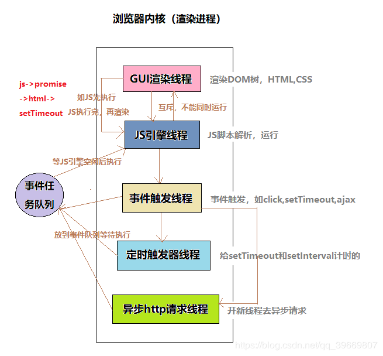
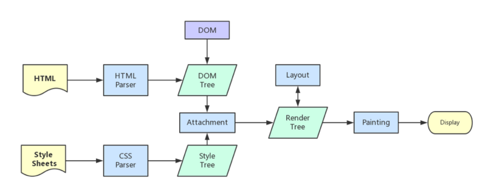

# 浏览器

## 进程与线程

### 一、概念

- 进程是 CPU 进行资源分配和调度的基本单位。执行一段程序，即一旦程序被载入到内存中并准备执行，它就是一个进程。进程是表示资源分配的的基本概念，又是调度运行的基本单位
- 单个进程中执行每个任务的就是一个线程。线程是 CPU 能够进行运算调度的最小单位，它被包含在进程之中，是进程中的实际运作单位。

### 二、区别

- 地址空间和资源：进程之间相互独立，同一进程的各线程间共享本进程的地址空间和资源（内存、I/O、cpu）。
- 调度和切换：线程上下文切换比进程上下文切换要快得多。

`一个程序至少一个进程，一个进程至少一个线程。`

### 三、比喻

- 进程是一个工厂，工厂有它的独立资源

- 工厂之间相互独立

- 线程是工厂中的工人，多个工人协作完成任务

- 工厂内有一个或多个工人

- 工人之间共享空间

完善概念

- 工厂的资源 -> 系统分配的内存（独立的一块内存）

- 工厂之间的相互独立 -> 进程之间相互独立

- 多个工人协作完成任务 -> 多个线程在进程中协作完成任务

- 工厂内有一个或多个工人 -> 一个进程由一个或多个线程组成

- 工人之间共享空间 -> 同一进程下的各个线程之间共享程序的内存空间（包括代码段、数据集、堆等）

#### 参考

- [进程和线程的区别](https://www.cnblogs.com/zhuzhu2016/p/5804875.html)
- [从浏览器多进程到 JS 单线程，JS 运行机制最全面的一次梳理](https://segmentfault.com/a/1190000012925872#articleHeader3)

 

## 浏览器是多进程的

### 一、浏览器包含哪些进程

1. Browser 进程：浏览器主进程，只有一个，负责协调、主控。
   - 负责浏览器界面显示，与用户交互。如前进，后退等。
   - 负责各个页面的管理，创建和销毁其他进程。
   - 将 Renderer 进程得到的内存中的 Bitmap，绘制到用户界面上。
   - 网络资源的管理，下载等。
2. GPU 进程
   - 用于硬件加速图形绘制
3. `渲染进程`(也就是我们常说的浏览器内核 Webkit 等)：
   - 内部是多线程的
   - 每个页面一个渲染进程互不影响(Chrome 中有一些优化，同一域名下的网站可共用一个渲染进程)
   - 用于解析页面，渲染页面，执行脚本，处理事件等等
4. 第三方插件进程：每种类型的插件对应一个进程，仅当使用该插件时才创建

### 二、浏览器为什么是多进程的

1. 避免单个 Tab 页或第三方插件奔溃从而影响整个浏览器
2. 多进程充分利用多核优势
3. 方便使用沙盒模型隔离插件等进程，提高浏览器稳定性

> 在浏览器中打开一个网页相当于新起了一个进程（进程内有自己的多线程）.如果浏览器是单进程，那么某个 Tab 页或者第三方插件崩溃了，就影响了整个浏览器，体验有多差，而且多进程还有其它的诸多优势，当然，多进程内存等资源消耗也会更大，有点空间换时间的意思。。

- [从浏览器多进程到 JS 单线程，JS 运行机制最全面的一次梳理](https://segmentfault.com/a/1190000012925872#articleHeader3)

 

## 浏览器的渲染进程

> 渲染进程又叫浏览器内核，与我们前端日常开发生活息息相关，需要着重了解。可以这样理解，页面的渲染，JS 的执行，事件的循环，都在这个进程内进行。

### 一、渲染进程包含哪些线程

1. GUI 渲染线程

   - 当浏览器收到响应的 html 后，该线程开始解析 HTML 文档构建 DOM 树，解析 CSS 文件构建 CSSOM，合并构成渲染树，并计算布局样式，绘制在页面上(该处可深挖的坑，HTML 解析规则，CSS 解析规则，渲染流程细节)
   - 当界面样式被修改的时候可能会触发 reflow 和 repaint，该线程就会重新计算，重新绘制，是前端开发需要着重优化的点

2. JS 引擎线程

   - JS 内核，也称 JS 引擎（例如 V8 引擎），负责处理执行 javascript 脚本程序，
   - 由于 js 是单线程（一个 Tab 页内中无论什么时候都只有一个 JS 线程在运行 JS 程序），依靠任务队列来进行 js 代码的执行，所以 js 引擎会一直等待着任务队列中任务的到来，然后加以处理。

3. 事件触发线程

   - 归属于渲染（浏览器内核）进程，不受 JS 引擎线程控制。主要用于控制事件（例如鼠标，键盘等事件），当该事件被触发时候，事件触发线程就会把该事件的处理函数添加进任务队列中，等待 JS 引擎线程空闲后执行

4. 定时器出发线程

   - 传说中的 setInterval 与 setTimeout 所在线程
   - 浏览器的定时器并不是由 JavaScript 引擎计数的，因为 JavaScript 引擎是单线程的, 如果处于阻塞线程状态就会影响计时的准确，因此通过单独的线程来计时并触发定时器，计时完毕后，满足定时器的触发条件，则将定时器的处理函数添加进任务队列中，等待 JS 引擎线程空闲后执行。

   - W3C 在 HTML 标准中规定，规定要求 setTimeout 中低于 4ms 的时间间隔算为 4ms

5. 异步 HTTP 请求线程

   - 当 XMLHttpRequest 连接后，浏览器会新开的一个线程，当监控到 readyState 状态变更时，如果设置了该状态的回调函数，则将该状态的处理函数推进任务队列中，等待 JS 引擎线程空闲后执行，**注意：浏览器对通一域名请求的并发连接数是有限制的，Chrome 和 Firefox 限制数为 6 个，ie8 则为 10 个。**

6. 总结：2-5 四个线程参与了 JS 的执行，但是永远只有 JS 引擎线程在执行 JS 脚本程序，其他三个线程只负责将满足触发条件的处理函数推进任务队列，等待 JS 引擎线程执行。
   

### 二、GUI 渲染线程与 JS 引擎线程互斥

由于 JavaScript 是可操纵 DOM 的，如果在修改这些元素属性同时渲染界面（即 JS 线程和 UI 线程同时运行），那么渲染线程前后获得的元素数据就可能不一致了。

因此为了防止渲染出现不可预期的结果，浏览器设置 GUI 渲染线程与 JS 引擎为互斥的关系。

当 JS 引擎执行时 GUI 线程会被挂起，GUI 更新则会被保存在一个队列中等到 JS 引擎线程空闲时立即被执行。

### 三、JS 阻塞页面加载

从上述的互斥关系，可以推导出，JS 如果执行时间过长就会阻塞页面。

譬如，假设 JS 引擎正在进行巨量的计算，此时就算 GUI 有更新，也会被保存到队列中，等待 JS 引擎空闲后执行。然后，由于巨量计算，所以 JS 引擎很可能很久很久后才能空闲，自然会感觉到巨卡无比。

所以，要尽量避免 JS 执行时间过长，这样就会造成页面的渲染不连贯，导致页面渲染加载阻塞的感觉。

### 四、CSS 加载是否会阻塞 DOM 树渲染？

- css 加载不会阻塞 DOM 树解析（css 是由单独的下载线程异步下载的。异步加载时 DOM 照常构建）
- 但会阻塞 render 树渲染（渲染时需等 css 加载完毕，因为 render 树需要 css 信息）

**为什么会阻塞 render 树的渲染？**

这可能也是浏览器的一种优化机制。

因为你加载 css 的时候，可能会修改下面 DOM 节点的样式，如果 css 加载不阻塞 render 树渲染的话，那么当 css 加载完之后，render 树可能又得重新重绘或者回流了，这就造成了一些没有必要的损耗。

所以干脆就先把 DOM 树的结构先解析完，把可以做的工作做完，然后等你 css 加载完之后，在根据最终的样式来渲染 render 树，这种做法性能方面确实会比较好一点。

### 五、浏览器的渲染过程

- 概念
  - `DOM Tree`： 浏览器将`HTML`解析成树形的数据结构。
  - `CSS Rule Tree`：浏览器将`CSS`解析成树形的数据结构。
  - `Render Tree`：`DOM`树和`CSS`规则树合并后生产`Render`树。
  - `Layout`（布局）：有了`Render Tree`，浏览器已经能知道网页中有哪些节点、各个节点的`CSS`定义以及他们的从属关系，从而去计算出每个节点在屏幕中的位置。
  - `Painting`（绘制）: 按照算出来的规则，通过显卡，把内容画到屏幕上。
  - `Reflow`（回流）：当浏览器发现某个部分发生了点变化影响了布局，需要倒回去重新渲染，内行称这个回退的过程叫 `reflow`。
  - `Repaint`（重绘）：改变某个元素的背景色、文字颜色、边框颜色等等不影响它周围或内部布局的属性时，屏幕的一部分要重画，但是元素的几何尺寸没有变。
  - 注意：`display:none`的节点不会被加入`Render Tree`，而`visibility: hidden`则会，所以`display:none会`触发`reflow`，`visibility: hidden`会触发`repaint`。

* 浏览器内核（渲染进程）拿到响应报文之后，渲染大概分为以下步骤:
  1. 解析`HTML`生成`DOM Tree`，同时浏览器主进程负责下载`CSS`文件
  2. `CSS`文件下载完成，解析`CSS`生成`CSS Tree`。
  3. 根据`DOM Tree`和`CSS Tree`生成`Render Tree`。
  4. 根据`Render`树进行`Layout`，负责各个元素节点的尺寸、位置计算。
  5. 绘制`Render`树(`Painting`)，绘制页面像素信息。
  6. 浏览器主进程将`默认图层`和`复合图层`交给`GPU`进程，`GPU`进程再将各个图层合成（`composite`），最后显示出页面

- 渲染完毕后`JS`引擎开始执行`load`事件，绘制流程见下图：
  

- **`load`事件与`DOMContentLoaded`事件的先后**

  - 当`DOMContentLoaded`事件触发时，仅当`DOM`加载完成，不包括样式表，图片。(譬如如果有 async 加载的脚本就不一定完成)

  - 当`onload`事件触发时，页面上所有的`DOM`，样式表，脚本，图片都已经加载完成了。（渲染完毕了）。所以，顺序是：`DOMContentLoaded` -> `load`

### 六、普通图层和复合图层

渲染步骤中就提到了`composite`概念。

可以简单的这样理解，浏览器渲染的图层一般包含两大类：`普通图层`以及`复合图层`

首先，普通文档流内可以理解为一个复合图层（这里称为`默认复合层`，里面不管添加多少元素，其实都是在同一个复合图层中）

其次，`absolute`布局（`fixed`也一样），虽然可以脱离普通文档流，但它仍然属于`默认复合层。`

然后，可以通过`硬件加速`的方式，声明一个`新的复合图层`，它会单独分配资源
（当然也会脱离普通文档流，这样一来，不管这个复合图层中怎么变化，也不会影响`默认复合层`里的回流重绘）

可以简单理解下：**`GPU`中，各个复合图层是单独绘制的，所以互不影响**，这也是为什么某些场景硬件加速效果一级棒

可以`Chrome`源码调试 -> `More Tools` -> `Rendering` -> `Layer borders` 中看到，黄色的就是复合图层信息

- **复合图层的好处**
  - 合成层的位图，会交由 `GPU` 合成，比 `CPU` 处理要快
  - 当需要 `repaint` 时，只需要 `repaint` 本身，不会影响到其他的层
  - 对于 `transform` 和 `opacity` 效果，不会触发 `layout` 和 `paint`
  - 但是尽量不要大量使用复合图层，否则由于资源消耗过度，页面反而会变的更卡

* **如何变成复合图层（硬件加速）**
  - 最常用的方式：`translate3d`、`translateZ`（`3D`或透视变换）
  -     `<video><iframe><canvas><webgl>`等元素
  - 元素有一个 `z-index` 较低且包含一个复合层的兄弟元素（换句话说就是该元素在复合层上面渲染）
  - 元素有一个包含复合层的后代节点（换句话说，就是一个元素拥有一个子元素，该子元素在自己的层里）

- **硬件加速时请使用`index`**

  - 使用`3D`硬件加速提升动画性能时，最好给元素增加一个`z-index`属性，人为干扰合成层的排序，可以有效减少`chrome`创建不必要的合成层，防止层爆炸，提升渲染性能，移动端优化效果尤为明显。
  - 原理：如果这个元素添加了硬件加速，并且`index`层级比较低，那么在这个元素的后面其它元素（层级比这个元素高的，或者相同的，并且`releative`或`absolute`属性相同的）， `会默认变为复合层渲染`，如果处理不当会极大的影响性能
  - 简单理解：**如果 a 是一个复合图层，而且 b 在 a 上面，那么 b 也会被隐式转为一个复合图层**
  - [问题验证](http://web.jobbole.com/83575/)

#### 参考

- [无线性能优化：Composite](https://fed.taobao.org/blog/2016/04/26/performance-composite/)
- [浅谈浏览器多进程与 JS 线程](https://segmentfault.com/a/1190000013083967#articleHeader2)

 

## 重绘与重排

### 一、区别

- 重排: 部分渲染树（或者整个渲染树）需要重新分析并且节点尺寸需要重新计算，表现为重新生成布局，重新排列元素
- 重绘: 由于节点的几何属性发生改变或者由于样式发生改变，例如改变元素背景色时，屏幕上的部分内容需要更新，表现为某些元素的外观被改变

单单改变元素的外观，肯定不会引起网页重新生成布局，但当浏览器完成重排之后，将会重新绘制受到此次重排影响的部分

**『重绘』不一定会出现『重排』，『重排』必然会出现『重绘』，在两者无法避免的情况下，尽可能的选择代价更小的重绘。**

### 二、如何触发重排和重绘？

任何改变用来构建渲染树的信息都会导致一次重排或重绘：

- 添加、删除、更新 DOM 节点
- 通过 display: none 隐藏一个 DOM 节点-触发重排和重绘
- 通过 visibility: hidden 隐藏一个 DOM 节点-只触发重绘，因为没有几何变化
- 移动或者给页面中的 DOM 节点添加动画
- 添加一个样式表，调整样式属性
- 用户行为，例如调整窗口大小，改变字号，或者滚动。

### 三、如何避免重绘或者重排？

- 提升为复合图层
- 通过 Css 类名的方式来集中改变样式
- 如果需要创建多个 DOM 节点，可以使用 DocumentFragment 创建完后一次性的加入 document
- 尽量的减少操作 DOM

## 同源策略

- 同源策略是浏览器的一种约定，也是浏览器最核心最基本的安全功能，如果缺少了同源策略，浏览器很容易受到 XSS、CSRF 等攻击。所谓同源是指**协议+域名+端口**三者相同，即便两个不同的域名指向同一个 ip 地址，也非同源。

* 同源策略限制的内容有：

  1. Cookie、LocalStorage、IndexedDB 等存储性内容
  2. DOM 节点不能操作
  3. AJAX 请求发送后，结果被浏览器拦截了

* 浏览器中的大部分内容都是受同源策略限制的，但是以下三个标签可以不受限制：  
  ``  
  `<link href=XXX>`  
  `<script src=XXX>`
