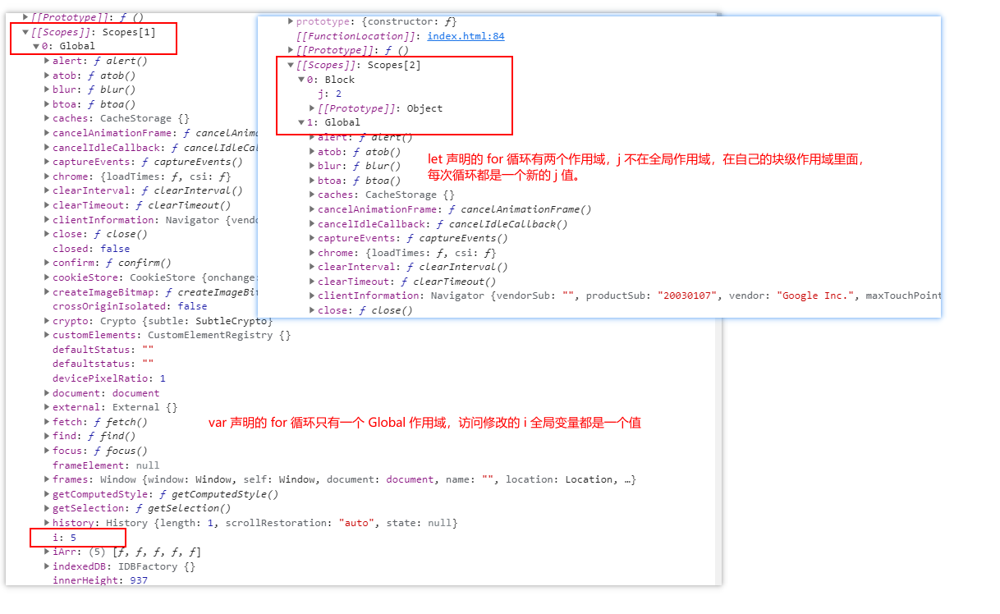

# 语言基础

[[toc]]

- 标识符：变量、属性、函数、函数参数名称。
- 关键字：case、break、if、else、typeof。
- 保留字：enum、package、public。

## var 关键字

### 1. 声明作用域

```js
function test() {
  var message = "hi"; // 局部变量，函数调用后就会被销毁
}
test();
console.log(message); // ReferenceError: message is not defined
```

```js
function test() {
  message = "hi"; // 全局变量
}
test();
console.log(message); // hi
```

### 2. 声明提升

```js
console.log(age); // undefined
var age = 26;
```

不会报错，因为使用`var`声明的变量会自动提升到函数作用域的顶部，等价于如下：

```js
var age;
console.log(age); // undefined
age = 26;
```

## let 声明

### 1. 块作用域

- 每一个同级代码块之间的作用域都是独立的，不能相互访问，`let`声明的作用域仅限于该代码块内部。`ES5`只有全局作用域和函数作用域。

```js
if (true) {
  var name = "Jack";
  let age = 26;
}
console.log(name); // Jack
console.log(age); // ReferenceError: age is not defined
```

### 2. 同一个块级作用域中不允许重复声明

- `let`和`var`混用也不允许重复声明，因为这两个关键字声明的是同类型的变量，只是指出变量在相关的作用域如何存在。

```js
var name;
let age;

let name; // SyntaxError: Identifier 'name' has already been declared
let age; // SyntaxError: Identifier 'age' has already been declared
```

- 嵌套使用时不会报错，因为变量声明的标识符和所在的块作用域不同。

```js
let age = 26;
if (true) {
  let age = 30;
  console.log(age); // 30
}
console.log(age); // 30
```

### 3. 暂时性死区

#### 3.1 变量不会被提升

- 在代码块内，通过`let`声明的变量在声明执行之前，该变量都是不可用的，这在语法上称为“暂时性死区”，简称 TDZ（temporal dead zone）。

```js
if (true) {
  // TDZ开始
  console.log(bar); // undefined
  console.log(foo); // ReferenceError: Cannot access 'foo' before initialization
  var bar = 1;
  let foo = 2; // TDZ结束
}
```

#### 3.2 暂时性死区 typeof

- “暂时性死区”也意味着`typeof`不再是一个百分之百安全的操作，如果使用`typeof`检测暂时性死区的变量，会抛出`ReferenceError`。

```js
console.log(typeof a); // undefined
console.log(typeof b); // ReferenceError: Cannot access 'b' before initialization

let b;
```

- 变量`b`在声明执行之前都属于`b`的死区，只要用到`b`变量就会抛出`ReferenceError`。而`a`是一个不存在的变量，反而返回`undefined`。

### 4. 全局声明

- 在全局作用域中`var`声明的变量会变成`window`对象的属性，而`let`不会，不过`let`声明仍然是在全局作用域中发生的，相应的变量会在页面的生命周期内存续。因此，重复声明时还是会报错。

```js
var name = "Jack";
console.log(window.name); // Jack

let age = 26;
console.log(window.age); // undefined

let age = 30; // SyntaxError: Identifier 'age' has already been declared
```

### 5. for 循环中的 let 声明

- 使用`var`声明的`i`变量是一个全局变量，即每次`for`循环时修改和访问的都是同一个全局变量。而`let`声明变量的作用域仅限于`for`循环内部，相当于每一次循环的`i`都是一个新的变量。

```js
for (var i = 0; i < 5; ++i) {
  // 循环逻辑
}
console.log(i); // 5

for (let j = 0; j < 5; ++j) {
  // 循环逻辑
}
console.log(j); // ReferenceError: j is not defined

for (var i = 0; i < 5; ++i) {
  setTimeout(() => {
    // 每个循环都引用全局的 i 变量
    console.log(i); // 输出：5、5、5、5、5
  }, 1000);
}

for (let i = 0; i < 5; ++i) {
  setTimeout(() => {
    // 每个循环引用不同的 i 变量
    console.log(i); // 输出：0、1、2、3、4
  }, 1000);
}
```

<br />

```js
for (let i = 0; i < 3; i++) {
  let i = 123;
  console.log(i); // 打印三次
}
```

- 打印三次`123`，由此可以看出`let`声明的循环变量跟循环体内的变量不是同一个作用域，因为同一个作用域不可使用`let`重复声明同一个变量。

<br/>

```js
var iArr = [];
for (var i = 0; i < 5; i++) {
  iArr[i] = function () {
    console.log(i);
  };
}
console.dir(iArr[2]);

var jArr = [];
for (let j = 0; j < 5; j++) {
  jArr[j] = function () {
    console.log(j);
  };
}
console.dir(jArr[2]);
```

- 上面代码的打印结果为



## const 声明

- `const`的行为于`let`基本相同，唯一一个重要的区别是用它声明变量时必须同时初始化变量，且不能修改。

```js
// 报错（暂时性死区）
console.log(age);   // ReferenceError: Cannot access 'age' before initialization

const age = 26;
if (true) {
  const age = 36;
}
// 块级作用域
console.log(age); // 26

// 报错（重新赋值）
age = 20;   // TypeError: Assignment to constant variable.

// 报错（未初始化）
const max;  // SyntaxError: Missing initializer in const declaration

// 报错（不允许重复声明）
const age = 46;  // SyntaxError: Identifier 'age' has already been declared
```

<br/>

### 本质

- `const`保证的是变量指向的那个`栈内存`所保存的数据不得改动。
- 简单数据类型，变量指向的`栈内存`中保存的是值，因此等同于常量。
- 复杂数据类型，变量指向的`栈内存`中保存的是指向实际数据的指针（指向堆内存的地址），`const`只能保证这个指针不变，至于指针指向的数据结构则不受控制。

```js
const person = {};

person.age = 26; // 不会报错

// 变量指向的内存中的指针变化了
person = {
  // 报错。TypeError: Assignment to constant variable.
  age: 36,
};
```

## 数据结构

- 七种简单数据类型（原始值）：Undefined、Null、Boolean、Number、String、Symbol（ES6 新增），Bigint（ES11 新增）。
- 一种复杂数据类型（引用值）：Object

### typeof 操作符

```js
console.log(typeof undefined); // undefined
console.log(typeof null); // object
console.log(typeof true); // boolean
console.log(typeof 1); // number
console.log(typeof "name"); // string
console.log(typeof Symbol(26)); // symbol
console.log(typeof 123n); // bigint(解决Number数据过大的精确度问题)
console.log(typeof function () {}); // function
console.log(typeof []); // object
console.log(typeof {}); // object
```

- undefined：未初始化变量，表示声明了一个变量，但没有赋值。一般不需要显示设置。`undefined`是由`null`派生来的。
- null：空对象指针，表示不存在、无效的对象或地址引用。一般变量要保存对象，但目前又没有那个对象可保存，就可以用`null`来填充（语义化）。

**注意**：严格来讲，函数也是对象，并不代表一种数据类型。可是，函数也有自己特殊的属性（任何实现内部[call]方法的对象都应该返回`function`）。所以，就有必要通过`typeof`操作符来区分函数和其它对象。
