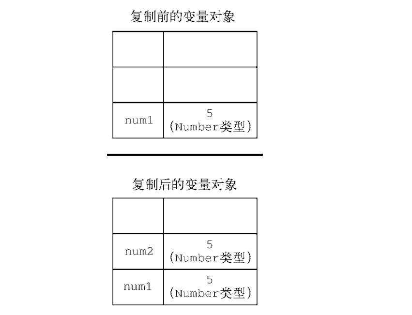
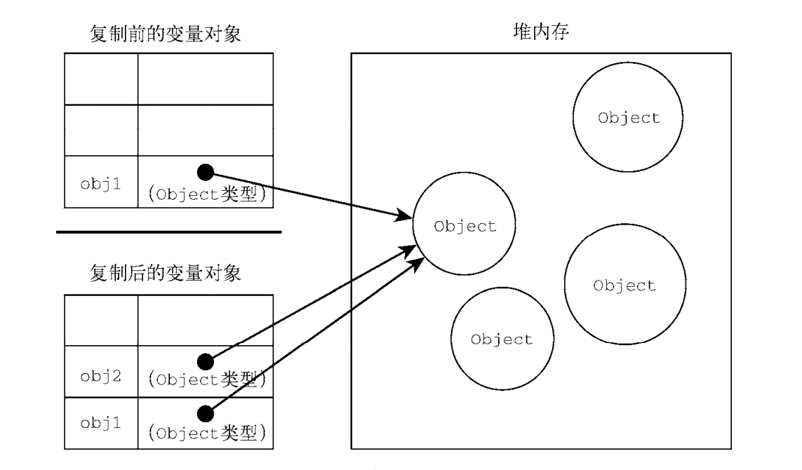

# 变量、作用域和内存

## 1、原始值与引用值

- 栈：有序排列，大小固定，比堆快。
- 堆：无序排列，大小不固定，比栈慢。

### 1.1 存储方式

- 原始值：数据存储在`栈内存`中。
- 引用值：数据存储在`堆内存`中，`栈内存`中存储的是一个`指针`，这个`指针`指向`堆内存`中的实际数据。

### 1.2 访问方式

- 原始值：按值访问
- 引用值：按引用访问。

### 1.3 动态属性

- 原始值：不能有属性，尽管给原始值添加属性不会报错。原始字面量形式才是原始值，使用`new`关键字则会创建一个对象实例。
- 引用值：可以随时添加、修改和删除其属性和方法

```js
const person = new Object();
person.age = 26;
console.log(person.age); // 26

const animal = "dog"; // 原始字面量形式
animal.age = 2;
console.log(animal.age); // undefined

const animal2 = new String("cat"); // new 关键字创建实例
animal2.age = 3;
console.log(animal2.age); // 3

console.log(typeof animal); // string
console.log(typeof animal2); // object
```

### 1.4 复制值

- 原始值：复制一份相同的值，两个值完全独立，互不影响。
- 引用值：也是复制一份相同的值，不同的是这里的值是一个**指针**，它指向存储在堆内存中的对象，所以两个变量实际上指向的还是同一个对象，因此，一个对象的变化会在另一个对象上反应出来。

```js
let num1 = 5;
let num2 = num1;
num2 = 10;
console.log(num1); // 5 互不影响
console.log(num2); // 10
```



```js
let obj1 = new Object();
let obj2 = obj1;
obj1.age = 26;
console.log(obj2.age); // 26
```



### 1.5 传递参数

- `ECMAScript`中所有函数的参数都是**按值传递**的。相当于将函数外的值复制到函数内部的参数中。如果是原始值，那么就跟原始值变量的复制一样。如果是引用值，那么就跟引用值变量的复制一样（复制的是指针地址）。

```js
function add(num) {
  num += 10;
  return num;
}
let count = 20;
let result = add(count);
console.log(count); // 20，没有改变，如果是按引用传递的话应该是30
console.log(result); // 30

function setAge(obj) {
  obj.age = 26;
}
let person = new Object();
setAge(person);
console.log(person.age); // 26，对象复制的是指针，所以改变其中一个对象也会反映到另一个对象上。
```

**注意**：`ECMAScript`中函数的参数就是局部变量。


## 2、执行上下文与作用域
- 每个上下文都有一个关联的**变量对象（variable object）**，而这个上下文中定义的所有变量和函数都存在这个对象上。
- 全局上下文是最外层的上下文，