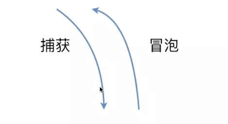
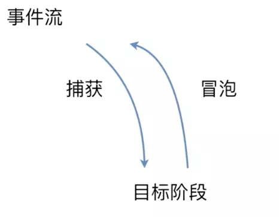
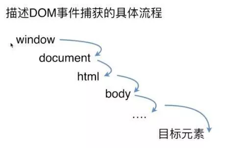

# DOM事件

## DOM 事件的级别

### DOM0 级

- 写法：`element.onclick=function(){}`或者或者`element.onclick=btnclick`是一种比较传统的方式，把一个函数(或者匿名函数)赋值给一个事件的处理程序属性
- 优点：简单，跨浏览器的优势（兼容所有浏览器）。
- 缺点：不能给元素添加多个事件处理程序，只能添加一个，如果添加多个事件处理程序，后面的会覆盖前面的。
- 删除事件：`element.onclick=null`;

### DOM1 级

- DOM1 级主要隐射文档没有事件，没有设计跟事件相关的东西，所以跳过，但是 DOM1 级标准还是存在

### DOM2 级

- 写法：`element.addEventListener('click',function(){},false)`false 为默认值，代表支持冒泡
- 优点，可以给元素添加多个事件处理程序，这些事件处理程序按照他们的顺序执行。
- 删除事件：`element.removeEventListener('click',function(){},false)`

### DOM3 级

- 写法：跟 DOM2 级一样，就是增加了许多事件类型，包括鼠标事件，键盘事件

## 事件模型



- 包括捕获和冒泡（ie 用的是事件冒泡）
- 捕获是从上往下到达目标元素
- 冒泡是从当前元素，也就是目标元素往上到 window。是两个过程

## 事件流



- 浏览器在为这个当前页面与用户做交互的过程中，比如我点击了这个鼠标左键，这个左键是怎么传到页面上，还有怎么响应的。

- 事件流分三个阶段，
  1. 第一阶段是捕获
  2. 第二阶段是目标阶段：比如点击的这个按钮，这个按钮就是目标阶段，事件通过捕获到达目标元素，就到达了目标阶段
  3. 第三个阶段是冒泡阶段：从目标元素再上传到 window 对象，就是冒泡的过程

## DOM 事件捕获冒泡的具体流程



- 事件捕获：捕获是从上到下

  1. 第一个真正接收的是 window（对象）
  2. 第二个接收的是 document（对象）
  3. 第三个接收的是 html 标签（获取 html 标签 document.documentElement）
  4. 第四个接收的是 body（document.body）
  5. 剩下的就是按照普通的 html 结构一层一层往下传，最后到达目标元素

- 事件冒泡：捕获是从下到上
  1. 第一个接收的是目标元素
  2. 第二个接收的是父级，按照 html 结构一层一层往上传
  3. 然后接收的是 body 标签 —> html 标签 —> document 对象
  4. 最后一个接收的是 window 对象。

## Event 事件对象

- 在触发 DOM 上的事件时都会产生一个对象，这个就是事件对象 Event
- Event 对象常用应用
  - `event.preventDefaulta()`阻止默认事件
  - `event.stopPropagetion()`阻止冒泡
  - `event.stopImmediatePropagation()`当一个元素绑定多个事件处理程序的时候，事件会按照顺序全部执行，如果不想让后面的事件处理程序执行，就在当前事件里加这个方法，后面的事件处理程序就不会执行了。
  - `event.currentTarget`获取绑定事件的元素
  - `event.target`获取触发事件的元素
  - `event.target.nodeName`获取触发事件元素的名字，如 P(大写)
  - `event.type`获取绑定的事件类型，比如 click，mouseover 等

## 自定义事件

- 所谓自定义事件，就是有别于带有浏览器特定行为的事件（类似 click、mouseover、submit、keydown），事件名称可以随意定义，可以通过特定的方法进行添加、触发以及删除。

```js
var eve=new Event('custome') // 自定义事件
var dom=document.getElementById('id')  // 获取DOM元素
dom.addEventListener('custome',function(){})   // 绑定事件
dom.dispatchEvent(eve)  // 触发事件

CustomEvent：也可以自定义事件，还可以自定义参数
```

## 代码演示

```js
window.addEventListener(
  "click",
  function() {
    console.log("window - 绑定事件触发");
  },
  false
);

document.addEventListener(
  "click",
  function() {
    console.log("document - 绑定事件触发");
  },
  false
);

document.documentElement.addEventListener(
  "click",
  function() {
    console.log("html - 绑定事件触发");
  },
  false
);

document.body.addEventListener(
  "click",
  function() {
    console.log("body - 绑定事件触发");
  },
  false
);

document.getElementById("wrap").addEventListener(
  "click",
  function() {
    console.log("父级 wrap - 绑定事件触发");
  },
  false
);

document.getElementById("box").addEventListener(
  "click",
  function() {
    console.log("box - 绑定事件触发");
  },
  false
);
```

- 设为 false(默认)表示支持冒泡，依次打印的顺序是:  
  `box - wrap - body - html - document - window`

- 设为 true 后表示支持捕获，依次打印的是相反的：  
  `window - document - html - body - wrap - box`

- 如果每个元素绑定两个事件，即支持捕获，又支持冒泡，那么捕获后冒泡打印的顺序：  
  `window - document - html - body - wrap - box - box - wrap - body - html - document - window`
