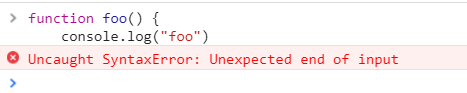
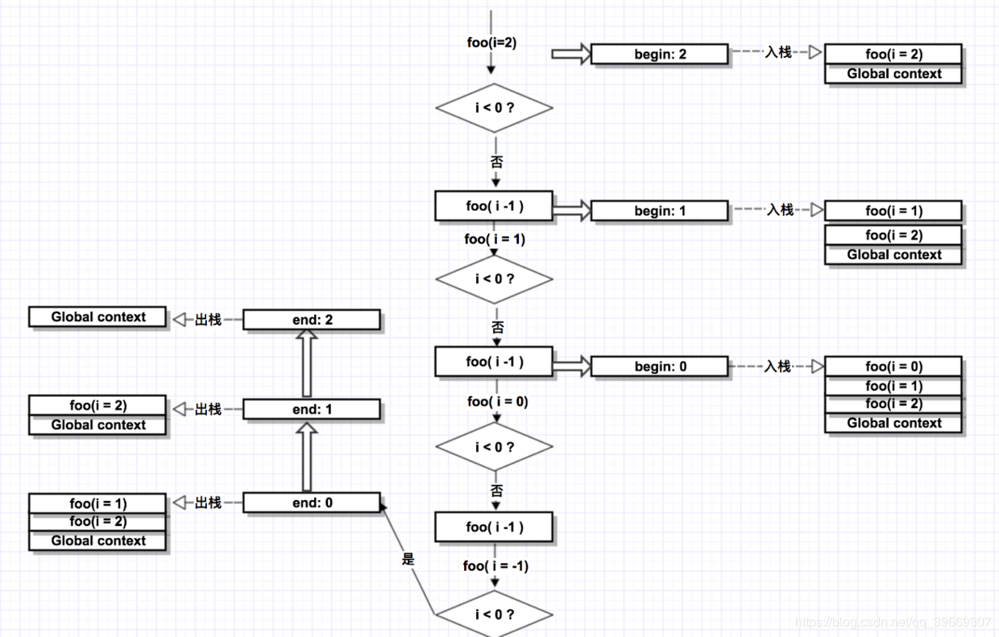
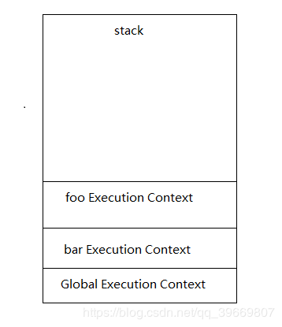
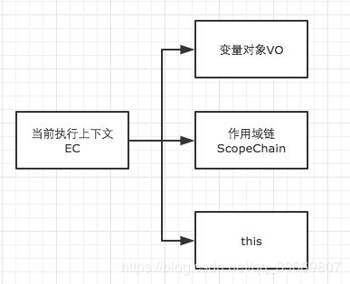
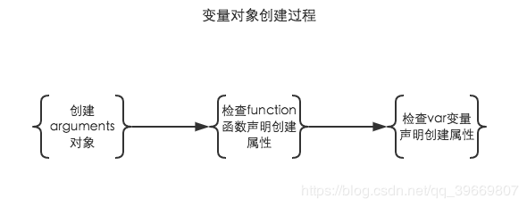
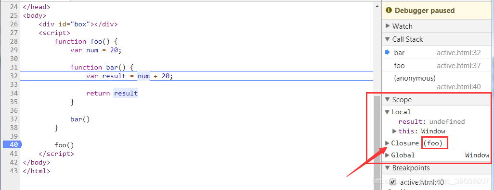
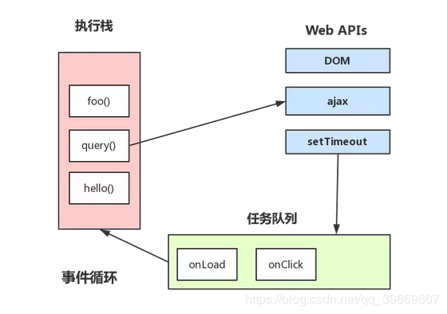
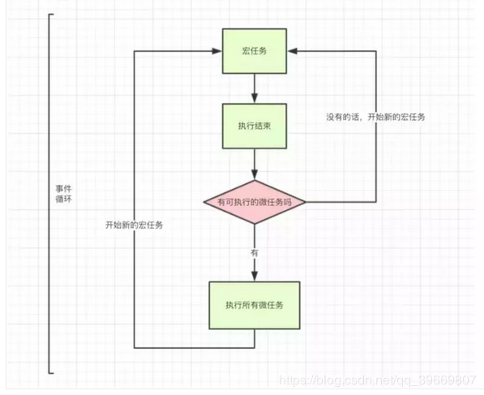

# JS 的执行过程

## 一、基本概念

> `JS`是单线程语言，一个页面永远只有一个线程在执行 js 脚本代码  
> `JS`是异步执行的，通过`事件循环（Event Loop）`的方式实现

### 1、为什么是单线程

- 防止当两个线程同时操作一个`DOM`时，会发生矛盾，

- 为了利用多核 CPU 的计算能力，HTML5 提出 Web Worker 标准，允许 JavaScript 脚本创建多个线程，但是子线程完全受主线程控制，且不得操作 DOM。所以，这个新标准并没有改变 JavaScript 单线程的本质。

- 虽然`JS`是单线程，但是浏览器总共开了四个线程参与了`JS`的执行，其他三个只是辅助，不参与解析与执行：

  1. JS 引擎线程（主线程，只有这个线程负责解析和执行 JS 代码）
  2. 事件触发线程
  3. 定时器触发线程
  4. HTTP 异步请求线程

**永远只有 JS 引擎线程在执行 JS 脚本程序，其他三个线程只负责将满足触发条件的处理函数推进任务队列，等待 JS 引擎线程执行。**

### 2、什么需要异步操作事件

由于`JS`是单线程的，一次只能执行一个任务，所以这些任务形成一个任务队列排队等候执行；

但是前端的某些任务是非常耗时的，比如网络请求，定时器和事件监听，如果让他们和别的任务一样排队等待执行的话，执行效率会非常的低，甚至导致页面的假死；

所以浏览器为这些耗时任务开辟了另外的线程，挂起处于等待中的任务，先运行排在后面的任务，当等待中的任务返回结果后再由主线程执行

### 3、JS 怎么通过单线程实现异步的？

`JS`是通过回调函数、setTimeout 等来实现异步，通过**事件循环**（Event Loop）机制来执行这些异步操作

## 二、JS 引擎的执行过程

```html
<script>
  console.log(fun); // 报错

  console.log(person); // 不执行
</script>

<script>
  console.log(person); // undefined

  console.log(fun); // fn

  var person = "Eric";

  console.log(person); // Eric

  function fun() {
    console.log(person); // undefined
    var person = "Tom";
    console.log(person); // Tom
  }

  fun();

  console.log(person); // Eric
</script>
```

- 从以上的示例得出，`JS`引擎的执行过程分为三个阶段：

  1. **语法分析阶段**： 分别对加载完成的代码块进行语法检验

     - 语法正确则进入预编译阶段；
     - 不正确则**停止**该代码块的执行，查找下一个代码块并进行加载

  2. **预编译阶段**：通过语法分析阶段后，进入预编译阶段

     - 则创建变量对象（创建`arguments`对象（函数运行环境下），函数声明提前解析，变量声明提升），确定作用域链以及`this`指向。

  3. **执行阶段**

### 1、语法分析阶段

- js 脚本代码块加载完毕后，会首先进入语法分析阶段。该阶段主要作用是：

> 分析该 js 脚本代码块的语法是否正确，如果出现不正确，则向外抛出一个语法错误（SyntaxError），停止该 js 代码块的执行，然后继续查找并加载下一个代码块；如果语法正确，则进入预编译阶段

- 语法错误报错如下图：



### 2、预编译阶段

- `js`代码块通过语法分析阶段后，语法正确则进入预编译阶段。在分析预编译阶段之前，我们先了解一下`js`的`运行环境`，运行环境主要有三种：

  1. **全局环境**：`JS`代码加载完毕后，进入代码预编译即进入全局环境

  2. **函数环境**：函数调用执行时，进入该函数环境，不同的函数则函数环境不同

  3. **eval**：不建议使用，会有安全，性能等问题

每进入一个不同的运行环境都会创建一个相应的**执行上下文（Execution Context）**

那么在一段`JS`程序中一般都会创建多个执行上下文

`js`引擎会以栈的方式对这些执行上下文进行处理，形成**函数调用栈（call stack）**

栈底永远是**全局执行上下文（Global Execution Context）**，栈顶则永远是**当前执行上下文**

#### **2.1、函数调用栈**

> 函数调用栈就是使用栈存取的方式进行管理运行环境，特点是先进后出，后进先出。

- 示例一

```js
function foo(i) {
  if (i < 0) return;
  console.log("begin:" + i);
  foo(i - 1);
  console.log("end:" + i);
}
foo(2);

// 输出:
// begin:2
// begin:1
// begin:0
// end:0
// end:1
// end:2
```

图解：



- 示例二

```js
function bar() {
  var B_context = "Bar EC";

  function foo() {
    var f_context = "foo EC";
  }

  foo();
}

bar();
```

- 上面的代码块通过语法分析后，进入预编译阶段，如下图：



- 步骤

1. 首先进入全局环境，创建`全局执行上下文`（Global Execution Context），推入`stack`栈中

2. 调用`bar`函数，进入`bar`函数运行环境，创建`bar函数执行上下文`（bar Execution Context），推入`stack`栈中

3. 在`bar`函数内部调用`foo`函数，则再进入`foo`函数运行环境，创建`foo函数执行上下文`（foo Execution Context），推入`stack`栈中、

4. 此刻栈底是`全局执行上下文`（Global Execution Contex），栈顶是`foo函数执行上下文`（foo Execution Context），如上图，由于`foo`函数内部没有再调用其他函数，那么则开始出栈，否则内部的函数继续执行入栈

5. `foo`函数执行完毕后，栈顶`foo函数执行上下文`（foo Execution Context）首先出栈

6. `bar`函数执行完毕，`bar函数执行上下文`（bar Execution Context）出栈

7. `全局执行上下文`（Global Execution Context）则在浏览器或者该标签页关闭时出栈。

注：不同的运行环境执行都会进入代码预编译和执行两个阶段，语法分析则在代码块加载完毕时统一检验语法

<br>

#### **2.2、创建执行上下文**

> 执行上下文可理解为当前的执行环境，与该运行环境相对应。创建执行上下文的过程中，主要做了以下三件事件，如图：



1. 创建变量对象（Variable Object）

2. 建立作用域链（Scope Chain）

3. 确定 this 的指向

##### 创建变量对象（Variable Object）

- 创建变量对象主要经过以下几个过程，如图：



1. 创建**arguments 对象**，检查当前上下文中的参数，建立该对象的属性与属性值，仅在函数环境(非箭头函数)中进行，全局环境没有此过程

2. 检查当前上下文的**函数声明**，按代码顺序查找，将找到的函数提前声明，如果当前上下文的变量对象没有该函数名属性，则在该变量对象以函数名建立一个属性，属性值则为指向该函数所在堆内存地址的引用，如果存在，则会被新的引用覆盖。

3. 检查当前上下文的**变量声明**，按代码顺序查找，将找到的变量提前声明，如果当前上下文的变量对象没有该变量名属性，则在该变量对象以变量名建立一个属性，属性值为**undefined**；如果存在，则忽略该变量声明

注：在全局环境中，`window`对象就是全局执行上下文的变量对象，所有的变量和函数都是`window`对象的属性方法。

所有函数声明提升和变量声明提升是在创建变量对象中进行的，且函数声明优先级高于变量声明。

- 示例：

```js
function fun(a, b) {
  var num = 1;

  function test() {
    console.log(num);
  }
}

fun(2, 3);
```

- 这里我们在全局环境调用`fun`函数，创建`fun`执行上下文，这里为了方便大家理解，暂时不讲解作用域链以及`this`指向，如下：

```js
funEC = {		// fun 函数的执行上下文
    //变量对象
    VO: {
        //arguments对象
        arguments: {
            a: undefined,
            b: undefined,
            length: 2
        },

        //test函数
        test: <test reference>,

        //num变量
        num: undefined
    },

    //作用域链
    scopeChain:[],

    //this指向
    this: window
}
```

- `funEC`表示`fun`函数的执行上下文（fun Execution Context 简写为 funEC）

- `funEC`的变量对象中`arguments`属性，上面的写法仅为了方便大家理解，但是在浏览器中展示是以类数组的方式展示的

- `<test reference>`表示`test`函数在堆内存地址的引用

注意：创建变量对象发生在预编译阶段，但尚未进入执行阶段，该变量对象都是不能访问的

因为此时的变量对象中的变量属性尚未赋值，值仍为`undefined`，只有进入执行阶段，才会对变量对象中的变量属性进行赋值

变量对象（Variable Object）转为活动对象（Active Object）后，才能进行访问，这个过程就是**VO –> AO**过程。

##### 建立作用域链

作用域链由当前执行环境的**变量对象（VO）**（未进入执行阶段前）与上层环境的一系列**活动对象（AO）**组成，它保证了当前执行环境对符合访问权限的变量和函数的有序访问。

- 示例：

```js
var num = 30;

function test() {
  var a = 10;

  function innerTest() {
    var b = 20;

    return a + b;
  }

  innerTest();
}

test();
```

在上面的例子中，当执行到调用`innerTest`函数，进入`innerTest`函数环境。

全局执行上下文和`test`函数执行上下文已进入执行阶段

`innerTest`函数执行上下文在预编译阶段创建变量对象，所以他们的活动对象和变量对象分别是`AO(global)`，`AO(test)`和`VO(innerTest)`

而`innerTest`的作用域链由当前执行环境的变量对象（未进入执行阶段前）与上层环境的一系列活动对象组成，如下：

```js
innerTestEC = {
  //变量对象
  VO: { b: undefined },

  //作用域链
  scopeChain: [VO(innerTest), AO(test), AO(global)],

  //this指向
  this: window
};
```

我们这里直接使用数组表示作用域链，作用域链的**活动对象**或**变量对象**可以直接理解为**作用域**。

- 作用域链的第一项永远是当前作用域（当前上下文的变量对象或活动对象）；

- 最后一项永远是全局作用域（全局执行上下文的活动对象）；

- 作用域链保证了变量和函数的有序访问，查找方式是沿着作用域链从左至右查找变量或函数，找到则会停止查找，找不到则一直查找到全局作用域，再找不到则会抛出引用错误。

> 在这里我们顺便思考一下，什么是**闭包**？

示例：

```js
function foo() {
  var num = 20;
  function bar() {
    var result = num + 20;
    return result;
  }
  bar();
}
foo();
```

- 因为对于闭包有很多不同的理解，这里以浏览器理解的闭包来分析闭包，如下图：



- 如上图所示，chrome 浏览器理解闭包是 foo，那么按浏览器的标准是如何定义闭包的，总结为三点：

1. **在函数内部定义新函数**

2. **新函数访问外层函数的局部变量，即访问外层函数环境的活动对象属性**

3. **新函数执行，创建新的函数执行上下文，外层函数即为闭包**

- 闭包的优点

  1. 实现公有变量： eg：函数累加器

  2. 可以做缓存（存储结构）：eg:eater

  3. 可以实现封装，属性私有化：eg:new Person();

  4. 模块化开发，防止污染全局变量

* 闭包的缺点
  1. 由于闭包携带包含它函数的作用域，因此比其他函数占用的内存更多，如果使用不当容易造成泄露内存；

##### 确定 this 指向

在全局环境下，全局执行上下文中变量对象的 this 属性指向为 window；函数环境下的 this 指向却较为灵活，需根据执行环境和执行方法确定

### **3、执行阶段（异步循环）**

示例：[来源](https://jakearchibald.com/2015/tasks-microtasks-queues-and-schedules/)

```js
console.log("script start");

setTimeout(function() {
  console.log("setTimeout");
}, 0);

Promise.resolve()
  .then(function() {
    console.log("promise1");
  })
  .then(function() {
    console.log("promise2");
  });

console.log("script end");
```

- 宏任务（macro-task）：主代码块、setTimeout、setInterval 等，宏任务又按执行顺序分为同步任务和异步任务

  - 同步任务
    ```js
    console.log("script start");
    console.log("script end");
    ```
  - 异步任务

    ```js
    setTimeout(function() {
      console.log("setTimeout");
    }, 0);
    ```

- 微任务（micro-task）：Promise、process.nextTick 等

```js
Promise.resolve()
  .then(function() {
    console.log("promise1");
  })
  .then(function() {
    console.log("promise2");
  });
```

- 执行顺序：

> 宏任务(同步任务) --> 微任务 --> 宏任务(异步任务)

- 输出结果：

> script start  
> script end  
> promise1  
> promise2  
> setTimeout

- 在 ES6 或 Node 环境中，JS 的任务分为两种，分别是宏任务（macro-task）和微任务（micro-task），在最新的 ECMAScript 中，微任务称为 jobs，宏任务称为 task

#### 宏任务

宏任务（macro-task）可分为同步任务和异步任务：

- 同步任务：在 JS 引擎主线程上按顺序执行的任务，只有前一个任务执行完毕后，才能执行后一个任务，形成一个执行栈（函数调用栈）。

- 异步任务：不直接进入 JS 引擎主线程，而是满足触发条件时，相关的线程将该异步任务推进**任务队列(task queue)**，等待 JS 引擎主线程上的任务执行完毕，空闲时读取执行的任务，例如异步 Ajax，DOM 事件，setTimeout 等。

理解宏任务中同步任务和异步任务的执行顺序，那么就相当于理解了 JS 异步执行机制–事件循环（Event Loop）。

#### 事件循环

- 事件循环可以理解成由三部分组成，分别是：

  1. **主线程执行栈**

  2. **异步任务等待触发**：浏览器为异步任务单独开辟的几个线程可以统一理解为`WebAPIs`

  3. **异步任务队列**：以队列的数据结构对事件任务进行管理，特点是先进先出，后进后出。



- 在 JS 引擎主线程执行过程中：

  1. 首先执行宏任务的同步任务，在主线程上形成一个执行栈，可理解为函数调用栈；

  2. 当执行栈中的函数调用到一些异步执行的 API（例如异步 Ajax，DOM 事件，setTimeout 等 API），则会开启对应的线程（Http 异步请求线程，事件触发线程和定时器触发线程）进行监控和控制

  3. 当异步任务的事件满足触发条件时，对应的线程则会把该事件的处理函数推进任务队列(task queue)中，等待主线程读取执行

  4. 当 JS 引擎主线程上的任务执行完毕，则会读取任务队列中的事件，将任务队列中的事件任务推进主线程中，按任务队列顺序执行

  5. 当 JS 引擎主线程上的任务执行完毕后，则会再次读取任务队列中的事件任务，如此循环，这就是事件循环（Event Loop）的过程

* 示例：

```js
console.log("script start");

setTimeout(function() {
  console.log("setTimeout");
}, 0);

console.log("script end");
```

- 代码执行过程：

1. JS 引擎主线程按代码顺序执行，当执行到 console.log('script start');，JS 引擎主线程认为该任务是同步任务，所以立刻执行输出 script start，然后继续向下执行；

2. JS 引擎主线程执行到`setTimeout(function() { console.log('setTimeout'); }, 0);`，JS 引擎主线程认为 setTimeout 是**异步任务**API，则向浏览器内核进程申请开启定时器线程进行计时和控制该 setTimeout 任务。由于 W3C 在 HTML 标准中规定 setTimeout 低于 4ms 的时间间隔算为 4ms，那么当计时到 4ms 时，定时器线程就把该回调处理函数推进任务队列中等待主线程执行，然后 JS 引擎主线程继续向下执行

3. JS 引擎主线程执行到 console.log('script end');，JS 引擎主线程认为该任务是同步任务，所以立刻执行输出 script end

4. JS 引擎主线程上的任务执行完毕（输出 script start 和 script end）后，主线程空闲，则开始读取任务队列中的事件任务，将该任务队里的事件任务推进主线程中，按任务队列顺序执行，最终输出 setTimeout，所以输出的结果顺序为 script start script end setTimeout

> 使用 setTimeout 模拟实现 setInterval，会有区别吗？

- 答案肯定是由区别的，我们不妨思考一下：

  1. setTimeout 实现 setInterval 只能通过递归调用

  2. setTimeout 是在到了指定时间的时候就把事件推到任务队列中，只有当在任务队列中的 setTimeout 事件被主线程执行后，才会继续再次在到了指定时间的时候把事件推到任务队列，那么 setTimeout 的事件执行肯定比指定的时间要久，具体相差多少跟代码执行时间有关

  3. setInterval 则是每次都精确的隔一段时间就向任务队列推入一个事件，无论上一个 setInterval 事件是否已经执行，所以有可能存在 setInterval 的事件任务累积，导致 setInterval 的代码重复连续执行多次，影响页面性能。

使用 setTimeout 或者 requestAnimationFrame 实现计时功能是比 setInterval 性能更好的

#### 微任务

微任务是在 es6 和 node 环境中出现的一个任务类型

如果不考虑 es6 和 node 环境的话，我们只需要理解宏任务事件循环的执行过程就已经足够了

但是到了 es6 和 node 环境，我们就需要理解微任务的执行顺序了

微任务（micro-task）的 API 主要有：Promise，process.nextTick

- 流程图：



在宏任务中执行的任务有两种，分别是**同步任务**和**异步任务**，因为异步任务会在满足触发条件时才会推进任务队列（task queue），然后等待主线程上的任务执行完毕，再读取任务队列中的任务事件，最后推进主线程执行，所以这里将异步任务即任务队列看作是**新的宏任务**。执行的过程如上图所示：

1. 执行宏任务中同步任务，执行结束；

2. 检查是否存在可执行的微任务，有的话执行所有微任务，然后读取任务队列的任务事件，推进主线程形成新的宏任务；没有的话则读取任务队列的任务事件，推进主线程形成新的宏任务

3. 执行新宏任务的事件任务，再检查是否存在可执行的微任务，如此不断的重复循环

示例：

```js
console.log("script start");

setTimeout(function() {
  console.log("setTimeout");
}, 0);

Promise.resolve()
  .then(function() {
    console.log("promise1");
  })
  .then(function() {
    console.log("promise2");
  });

console.log("script end");
```

输出结果为：

> script start  
> script end  
> promise1  
> promise2  
> setTimeout

- 执行过程：

1. 代码块通过语法分析和预编译后，进入执行阶段，当 JS 引擎主线程执行到`console.log('script start')`;，JS 引擎主线程认为该任务是**同步任务**，所以立刻执行输出 script start，然后继续向下执行；

2. JS 引擎主线程执行到`setTimeout(function() { console.log('setTimeout'); }, 0)`;，JS 引擎主线程认为 setTimeout 是**异步任务 API**，则向浏览器内核进程申请开启定时器线程进行计时和控制该 setTimeout 任务。由于 W3C 在 HTML 标准中规定 setTimeout 低于 4ms 的时间间隔算为 4ms，那么当计时到 4ms 时，定时器线程就把该回调处理函数推进任务队列中等待主线程执行，然后 JS 引擎主线程继续向下执行

3. JS 引擎主线程执行到`Promise.resolve().then(function() { console.log('promise1'); }).then(function() { console.log('promise2'); });`，JS 引擎主线程认为 Promise 是一个**微任务**，这把该任务划分为微任务，等待执行

4. JS 引擎主线程执行到`console.log('script end')`;，JS 引擎主线程认为该任务是**同步任务**，所以立刻执行输出 script end

5. 主线程上的宏任务执行完毕，则开始检测是否存在可执行的微任务，检测到一个**Promise 微任务**，那么立刻执行，输出 promise1 和 promise2

6. 微任务执行完毕，主线程开始读取任务队列中的事件任务 setTimeout，推入主线程形成**新宏任务**，然后在主线程中执行，输出 setTimeout

#### 总结

- 主线程执行一个**同步宏任务**，过程中如果遇到**异步宏任务**，就交给浏览器其他线程处理，当满足事件触发条件时就把该回调处理函数推进**任务队列**中等待主线程执行。

- 如果遇到**微任务**，就放入微任务事件队列中，等待执行。

- 当前**同步宏任务**执行完成后，会查找**微任务**的事件队列，将全部的微任务依次执行完，再去读取任务队列中的**异步宏任务**，推入主线程形成**新宏任务**，然后在主线程中执行。

- 执行顺序：**同步宏任务 → 微任务 promise→ 微任务 process.nextTick→ 异步宏任务**

需要注意的是：在 node 环境下，process.nextTick 的优先级高于 promise。也就是可以简单理解为，在宏任务结束后会先执行微任务队列中的 nextTickQueue 部分，然后才会执行微任务中的 promise 部分。

#### 参考文献

- [js 的单线程和异步](https://www.cnblogs.com/woodyblog/p/6061671.html)

- [js 引擎的执行过程](https://heyingye.github.io/2018/03/19/js%E5%BC%95%E6%93%8E%E7%9A%84%E6%89%A7%E8%A1%8C%E8%BF%87%E7%A8%8B%EF%BC%88%E4%B8%80%EF%BC%89/#%E5%88%9B%E5%BB%BA%E6%89%A7%E8%A1%8C%E4%B8%8A%E4%B8%8B%E6%96%87)
