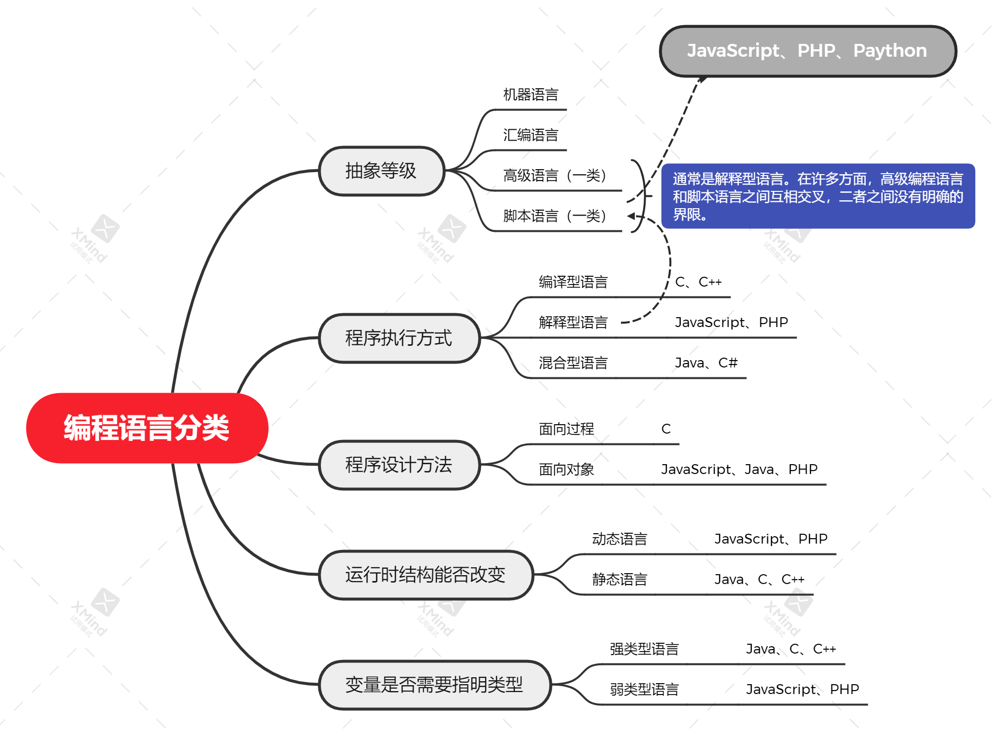
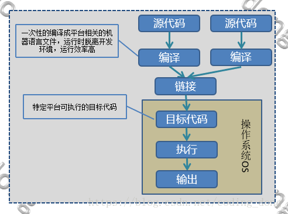
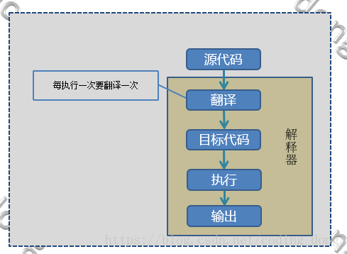
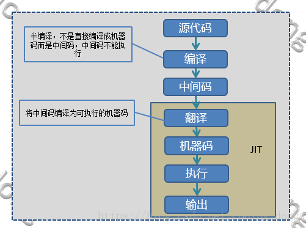

# 编程语言

## 语言分类

## 脚本语言

是为了缩短传统的“编写、编译、链接、运行”（edit-compile-link-run）过程而创建的计算机编程语言，一个脚本通常是**解释运行而非编译**，在许多方面，高级编程语言和脚本语言之间互相交叉，二者之间没有明确的界限。脚本就是给机器一行一行执行的文本。解释型语言包含脚本语言。

## 编译型、解释型、混合型

高级语言需要翻译成机器语言才能被计算机识别，翻译的方式有两种，一种是编译，一种是解释。

### 1、编译型

通过**编译器**（compiler）来实现，需要通过编译器将源代码编译成机器码，之后才能执行的语言。一般需经过编译（compile）、链接（linker）这两个步骤。编译是把源代码编译成机器码，链接是把各个模块的机器码和依赖库串连起来生成可执行文件。

- 优点：编译器一般会有预编译的过程对代码进行优化。因为编译只做一次，运行时不需要编译，所以编译型语言的程序执行效率高。可以脱离语言环境独立运行（编译后生成的可执行文件，是 cpu 可以理解的 2 进制的机器码组成的）。
- 缺点：编译之后如果需要修改就需要整个模块重新编译。编译的时候根据对应的运行环境生成机器码，不同的操作系统之间移植就会有问题，需要根据运行的操作系统环境编译不同的可执行文件。

### 2、解释型

通过**解释器**（interpreter）来实现，解释型语言的程序不需要编译，相比编译型语言省了道工序，解释型语言在运行程序的时候才逐行翻译。每一个语句都是执行的时候才能翻译。这样解释型语言每执行一次要翻译一次，效率表较低。

- 优点：有良好的平台兼容性，在任何环境中都可以运行，前提是安装了解释器（虚拟机）。灵活，修改代码的时候直接修改就可以，可以快速部署，不用停机维护。
- 缺点：每次运行的时候都要解释一遍，性能上不如编译型语言。

### 3、混合型

混合型语言也叫半编译型语言。比如 java、C#，C#在编译的时候不是直接编译成机器码而是中间码，.NET 平台提供了中间语言运行库运行中间码，中间语言运行库类似于 Java 虚拟机。.net 在编译成 IL 代码后，保存在 dll 中，首次运行时由 JIT 在编译成机器码缓存在内存中，下次直接执行。

java 解释器采用生成与系统无关的字节代码指令技术。也就是说，在任何不同的操作系统上，只要正确安装了 java 运行系统，就有了编写调试 java 程序的平台，在分布式应用中，java 的这个特点使同一个 java 程序能在不同的系统上运行，从而提高了软件生产效率。可移植性是跨平台特性的一个延伸，即具有了跨平台性，就保证了可移植性。java 程序、java 类库、java 编译器、java 系统都具有可移植性。

另外有一个特殊的情况，正常情况下 JavaScript 属于解释性语言，V8 引擎是被设计用来提高网页浏览器内部 JavaScript 执行的性能，为了提高性能，v8 会把 js 代码转换为高效的机器码，而不在是依赖于解释器去执行。v8 引入了 JIT 在运行时把 js 代码进行转换为机器码。这里的主要区别在于 V8 不生成字节码或任何中间代码。这里的特殊之处在于 JIT 做代码优化(同时生成编译版本)；解释型语言无法做到这些。

## 动态结构语言、静态结构语言

- 主要针对点是：运行时是否能够改变代码结构。

### 1、动态结构语言

在运行时可以改变其结构的语言：例如新的函数、对象、甚至代码可以被引进，已有的函数可以被删除或是其他结构上的变化。通俗点说就是在运行时代码可以根据某些条件改变自身结构。如：JavaScript、PHP、Python。

### 2、静态结构语言

与动态语言相对应的，运行时结构不可变的语言就是静态语言。如 Java、C#。

## 动态类型语言、静态类型语言

- 主要针对点是：数据类型检查的时间问题。动态类型语言是指在运行期间才去做数据类型检查的语言，说的是数据类型，动态语言说的是运行是改变结构，说的是代码结构，两个是不同的概念。

### 1、动态类型语言

动态语言是在运行时确定数据类型的语言。变量使用之前不需要类型声明，通常变量的类型是被赋值的那个值的类型。如：JavaScript、PHP、Python。

### 2、静态类型语言

静态语言是在编译时变量的数据类型即可确定的语言，静态类型语言要求在使用变量之前必须声明数据类型。如 Java、C#。

## 弱类型语言、强类型语言

### 1、弱类型语言

数据类型可以被忽略，一个变量可以赋不同数据类型的值。一旦给一个整型变量 a 赋一个字符串值，那么 a 就变成字符类型。如：JavaScript、C、C++（C 和 C++有争议，但是确实可以给一个字符变量赋整形值，可能初衷是强类型，形态上接近弱类型）

### 2、强类型语言

一旦一个变量被指定了某个数据类型，如果不经过强制类型转换，那么它就永远是这个数据类型。你不能把一个整型变量当成一个字符串来处理。如 Java、C#、Python。

### 3、注意

一个语言是不是强类型语言和是不是动态类型语言也没有必然联系。Python 是动态类型语言，是强类型语言。JavaScript 是动态类型语言，是弱类型语言。Java 是静态类型语言，是强类型语言。

## 参考文献

- [编程语言的分类与关系](https://blog.csdn.net/coding_dong/article/details/80920571?utm_medium=distribute.pc_relevant.none-task-blog-baidujs_baidulandingword-1&spm=1001.2101.3001.4242)
- [一图看懂编程语言分类](https://blog.csdn.net/acelit/article/details/62466679)
