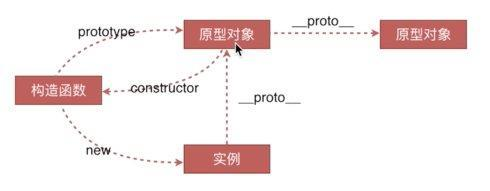
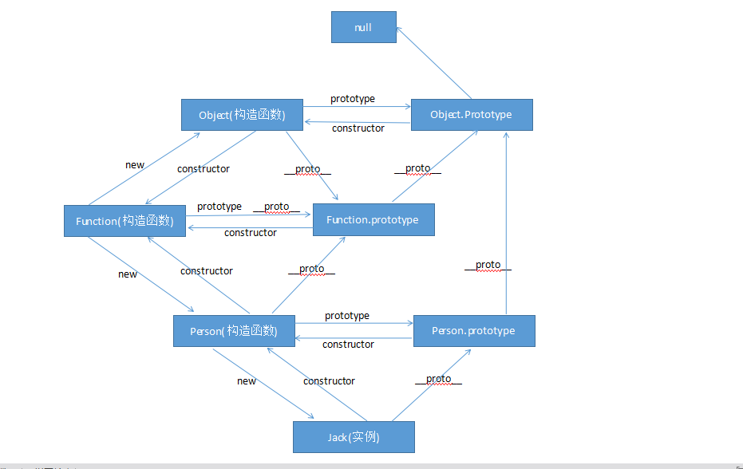

# 原型链

## 一、创建对象的几种方法

- 对象字面量

```js
let o1 = { name: "o1" };
```

- Object 构造函数

```js
let o2 = new Object({ name: "o2" });
```

- 构造函数

```js
  let M = function () { this.name = 'o3' }
  let 03 = new M()
```

- Object.create

```js
let P = { name: "o4" };
let o4 = Object.create(P); // 自身没有name属性，在原型链上，用原型链连接
o4.__proto__; //  {name: "o4"}
```

## 二、原型对象、构造函数、实例



### 原型对象、构造函数、实例三者的关系

1. `prototype`：隐式原型，返回的是对象，无论在什么时候，只要创建了一个新函数，就会根据一组特定的规则为该函数创建一个`prototype`属性，这个属性指向函数的原型对象，**只有函数对象才有`prototype`属性**，普通对象没有

```js
[].prototype; // undefined
```

2. `constructor`：构造函数，返回的是函数，在默认情况下，所有原型对象都会自动获得一个 constructor 属性，**所有的值都有`constructor`属性**，指向构造出自己的构造函数，如果是原始值的话内部会调用包装类

```js
"a".constructor; // ƒ String() { [native code] }
//内部调用包装类   new String('a').constructor
```

3. `__proto__`：显式原型，返回的是对象，**所有的值都有`__proto__`属性**，指向自己构造函数的原型，如果是原始值的话内部会调用包装类

```js
"a".__proto__ === String.prototype; //  true
//内部调用包装类   new String('a').__proto__
```

4.  特殊：`null`跟`undefined`没有`prototype、constructor、__proto__`属性

- **Function**：每个函数被定义时都都会自动添加一个`constructor`属性，所有函数（包括系统构造函数）的`constructor`属性都指向`Function`构造函数，包括`Function`自己，也可以说所有的函数都是`Funtion`的实例

```js
function test() {}
test.constructor === Function; // true
Object.constructor === Function; // true
Function.constructor === Function; // true
```

因为函数也是对象（特殊的对象），所以也有`__proto__`属性，但是所有函数的`__proto__`打印出来都是一个空函数，

```js
test.__proto__; // ƒ () { [native code] }
Object.__proto__; // ƒ () { [native code] }
Function.__proto__; // ƒ () { [native code] }
// 用console.log()打印出来的结果一样
```

由于所有的函数都是被`Function`构造出来的，所以这个空函数指向`Function`的原型对象（`Function.prototype`）,

```js
// 但所有函数的__proto__（空函数）都指向Function.prototype
test.__proto__ === Function.prototype; // true
Object.__proto__ === Function.prototype; // true
Function.__proto__ === Function.prototype; // true
```

其他函数的`prototype`都指向自身的原型对象，只有`Function`的`prototype`指向的是一个空函数，并且这个空函数指向自身的`__proto__`

```js
test.prototype; // {constructor: ƒ}
Object.prototype; // {constructor: ƒ, __defineGetter__: ƒ, __defineSetter__: ƒ, hasOwnProperty: ƒ, __lookupGetter__: ƒ, …}
Function.prototype; // ƒ () { [native code] }  打印一个空函数
Function.prototype === Function.__proto__; // true 指向同一个对象
```

所以`Function`的`__proto__`和`prototype`指向的是同一块空间

```js
test.__proto__ === Function.__proto; // true
Object.__proto__ === Function.__proto__; // true
Function.__proto__ === Function.__proto__; // true
```

- 实例是被构造函数用`new`操作符创建的
- 实例的`constructor`属性指向构造函数
- 实例的`__proto__`属性指向原型对象
- 实例没有`prototype`属性

---

- 原型对象是构造函数被创建时自动生成的
- 原型对象的`constructor`属性指向构造函数
- 原型对象的`__proto__`属性指向下一个原型对象，终点是`Object.prototype`
- 原型没有`prototype`属性

---

- 构造函数是被`Function`用`new`操作符创建的
- 构造函数的`constructor`指向`Function`
- 构造函数的`__proto__`指向`Function`的原型对象(**是一个函数**)
- 构造函数的`prototype`属性指向自己的原型对象

---

- `Function`是被自己创建出来的
- `Function`的`constructor`属性指的就是自己
- `Function`的`__proto__`指向自己的原型（**因为是被自己创建出来的，所以指向的是自己**）
- `Function`的`prototype`指向一个函数，这个函数的**proto**指向`Object.prototype`

---

- `Object构造函数`是被`Function`用`new`操作符创建的
- `Object`的`constructor`指向`Function`
- `Object`的`__proto__`指向`Function`的原型对象(**是一个函数**)
- `Object`的`prototype`属性指向自己的原型对象,**也是所有原型链的终点**



## 三、instanceof 原理

- 用来测试一个对象在其原型链中是否存在一个构造函数的 prototype 属性。

```js
A instanceof B   判断 A 对象的原型链上有没有 B 的原型对象
```

- 判断一个值是不是一个数组

```js
[] instanceof Array; //  ture
```

- 虽然返回了 true 但是`instanceof`不严谨

```js
[] instanceof Object; // 也返回true,因为Object.prototype在[]的原型链上，所以也返回了true
```

- 判断对象是不是构造函数的实例，推荐使用`constructor`来判断

```js
[].constructor === Array  // true
[].constructor === Object  // false
```

## 四、new 运算符

1. 一个新对象被创建，他继承自 foo.prototype

2. 将构造函数的作用域符给新对象，也就是 this 指向了这个新对象

3. 执行构造函数中的代码（为这个新对象添加属性）

4. 返回这个新对象

**注意：**new foo 等同于 new foo()，但只能在不传递任何参数的情况下使用。因为构造函数默认返回这个新对象，所以如果手动返回对象的话就会取代整个 new 出来的结果
