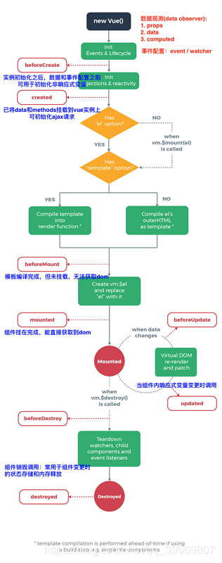

# 生命周期



## Vue 生命周期的四个阶段

> Vue 生命周期分为 创建、挂载、更新、销毁四个阶段：

1. `beforeCreate`（创建前）：实例初始化之后，this 指向创建的实例，不能访问到 data、computed、watch、methods 上的方法和数据。用于初始化非响应式变量和显示 loading
2. `created`（创建后）：可访问 data、computed、watch、methods 上的方法和数据，未挂载到 DOM，不能访问到 el 属性，refs 属性内容为空。用于简单的 ajax 请求，页面的初始化
3. `beforeMount`（挂载前）：编译模板为虚拟 dom 放入到 render 函数中准备渲染，然后执行 beforeMount 钩子函数，虚拟 dom 已经创建完成，马上就要渲染，在这里也可以更改数据，不会触发其他的钩子函数，一般可以在这里做初始数据的获取，可以访问 el(挂载根节点) 但是无法访问 refs(真实节点)
4. `mounted`（挂载后）：组件已经出现在页面中，数据、真实 dom 都已经处理好了,事件都已经挂载好了，可以在这里操作真实 dom 等事情。用于获取数据后操作真实的 DOM。
5. `beforeUpdate`（更新前）：当组件或实例的数据更改之后，会立即执行 beforeUpdate，然后 vue 的虚拟 dom 机制会重新构建虚拟 dom 与上一次的虚拟 dom 树利用 diff 算法进行对比之后重新渲染，一般不做什么事儿
6. `updated`（更新后）：当更新完成后，执行 updated，数据已经更改完成，dom 也重新 render 完成，可以操作更新后的虚拟 dom
7. `beforeDestroy`（销毁前）：当经过某种途径调用\$destroy 方法后，立即执行 beforeDestroy，一般在这里做一些善后工作，例如清除计时器、清除非指令绑定的事件等等
8. `destroyed`（销毁后）：组件的数据绑定、监听...去掉后只剩下 dom 空壳，这个时候，执行 destroyed，在这里做善后工作也可以

## keep-alive 钩子函数

当使用`keep-alive`包裹动态组件时，会缓存不活动的组件实例，而不是销毁它们

当组件在 `<keep-alive>` 内被切换，它的 `activated` 和 `deactivated` 这两个生命周期钩子函数将会被对应执行。

- activated：keep-alive 组件激活时调用。
- deactivated：keep-alive 组件停用时调用。

注意：当引入 keep-alive 的时候，页面第一次进入，钩子的触发顺序`created-> mounted-> activated`，退出时触发 deactivated。当再次进入（前进或者后退）时，只触发 activated。

## 组件内路由钩子函数

1. beforeRouteEnter(进入组件之前)：不能访问 this，因为守卫在导航确认前被调用,因此即将登场的新组件还没被创建。不过， 你可以通过传一个回调给 next 来访问组件实例。在导航被确认的时候执行回调，并且把组件实例作为回调方法的参数。

```js
beforeRouteEnter (to, from, next) {
  next(vm => {
    // 通过 `vm` 访问组件实例
  })
}
```

2. beforeRouteUpdate(子路由切换时执行)
3. beforeRouteLeave(离开组件之前)：通常用来提示用户在未保存某些修改而后退时的提示。该导航可以通过 next(false) 来取消。

```js
beforeRouteLeave (to, from , next) {
  if ('用户保存了') {
    next()
  } else {
    next(false)
  }
}
```

## 单个路由钩子函数

1. beforeEnter
2. beforeLeave

## 全局路由钩子函数

1. beforeEach（进入路由之前）：权限控制，开启进度条
2. beforeResolve（路由确认时解析守卫）
3. afterEach（进入路由之后）：关闭进度条
