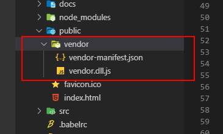

# 打包构建优化

## 1、安装相关插件

```js
npm i -D add-asset-html-webpack-plugin clean-webpack-plugin
```

## 2、编写配置文件

- 在项目根目录下新建 webpack.dll.conf.js，输入以下内容。

```js
const path = require("path");
const webpack = require("webpack");
const { CleanWebpackPlugin } = require("clean-webpack-plugin");

// dll文件存放的目录
const dllPath = "public/vendor";

module.exports = {
  entry: {
    // 需要提取的库文件
    vendor: ["vue", "vue-router", "vuex", "axios"]
  },
  output: {
    path: path.join(__dirname, dllPath),
    filename: "[name].dll.js",
    // vendor.dll.js中暴露出的全局变量名
    // 保持与 webpack.DllPlugin 中名称一致
    library: "[name]_[hash]"
  },
  plugins: [
    // 清除之前的dll文件
    new CleanWebpackPlugin(),
    // 设置环境变量
    new webpack.DefinePlugin({
      "process.env": {
        NODE_ENV: "production"
      }
    }),
    // manifest.json 描述动态链接库包含了哪些内容
    new webpack.DllPlugin({
      path: path.join(__dirname, dllPath, "[name]-manifest.json"),
      // 保持与 output.library 中名称一致
      name: "[name]_[hash]",
      context: process.cwd()
    })
  ]
};
```

## 3、添加命令生成 Dll

- 在 package.json 中加入如下命令然后

```js
"scripts": {
    "dll": "webpack -p --progress --config ./webpack.dll.conf.js"
},
```

- 运行`npm run dll`，会在 public 文件夹下生成 vendor 文件夹，里面包含 vendor-manifest.json 和 vendor.dll.js
  

## 4、忽略已经编译的文件

- 在 vue.config.js 中加入以下配置，告诉 webpack 哪些文件已被预编译，使 webpack 构建的时候忽略这些已预编译的文件

```js
const webpack = require("webpack");

module.exports = {
  configureWebpack: {
    plugins: [
      new webpack.DllReferencePlugin({
        context: process.cwd(),
        manifest: require("./public/vendor/vendor-manifest.json")
      })
    ]
  }
};
```

## 5、引入 Dll 文件

- 在 index.html 中引入生成的 dll 文件

```html
<script src="./vendor/vendor.dll.js"></script>
```

## 6、配置自动引入

- 手动引入的方式不够优雅，在 vue.config.js 中使用 add-asset-html-webpack-plugin 来实现自动引入

```js
const webpack = require("webpack");
const AddAssetHtmlPlugin = require("add-asset-html-webpack-plugin");

module.exports = {
  configureWebpack: {
    plugins: [
      new webpack.DllReferencePlugin({
        context: process.cwd(),
        manifest: require("./public/vendor/vendor-manifest.json")
      }),
      // 将 dll 注入到 生成的 html 模板中
      new AddAssetHtmlPlugin({
        // dll文件位置
        filepath: path.resolve(__dirname, "./public/vendor/*.js"),
        // dll 引用路径
        publicPath: "./vendor",
        // dll最终输出的目录
        outputPath: "./vendor"
      })
    ]
  }
};
```
