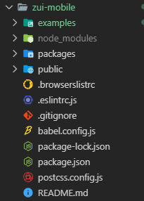
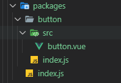
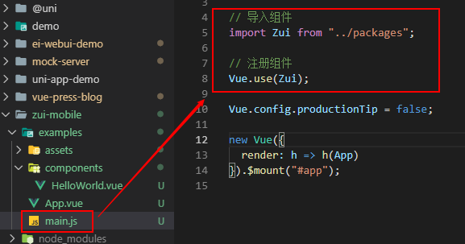
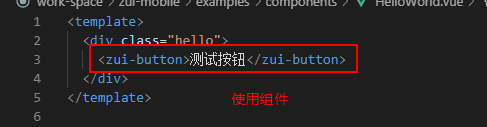
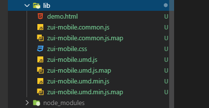

# 搭建 UI 库


## 规划目录结构

### 创建项目
- 安装 `vue-cli3`，执行命令 `vue create zui-mobile`，创建一个空项目

### 调整目录
```js
...
|-- examples      // 原 src 目录，改成 examples 用作示例展示
|-- packages      // 新增 packages 用于编写存放组件
...
```



## 配置项目
通过上一步的目录改造后，会遇到两个问题。  
1. `src`目录更名为`examples`，导致项目无法运行
2. 新增`packages`目录，该目录未加入`webpack`编译

**注：cli3 提供一个可选的 `vue.config.js` 配置文件。如果这个文件存在则他会被自动加载，所有的对项目和`webpack`的配置，都在这个文件中。**

### 解决第一个问题
- 新建 `vue.config.js`
- 使用 `vue.config.js` 中的 `pages` 选项构建一个多页面的应用，将入口修改到`examples`
```js
module.exports = {
  // 修改 pages 入口
  pages: {
    index: {
      entry: "examples/main.js", // 入口
      template: "public/index.html", // 模板
      filename: "index.html" // 输出文件
    }
  },
};
```
### 解决第二个问题
- `packages` 是我们新增的一个目录，默认是不被 `webpack` 处理的，所以需要添加配置对该目录的支持。
- `chainWebpack` 是一个函数，会接收一个基于 `webpack-chain` 的 `ChainableConfig` 实例。允许对内部的 `webpack` 配置进行更细粒度的修改。
```js
const path = require("path");
module.exports = {
  // 修改 pages 入口
  pages: {
    index: {
      entry: "examples/main.js", // 入口
      template: "public/index.html", // 模板
      filename: "index.html" // 输出文件
    }
  },
  // 扩展 webpack 配置
  chainWebpack: config => {
    // @ 默认指向 src 目录，这里要改成 examples
    // 另外也可以新增一个 ~ 指向 packages
    config.resolve.alias
      .set("@", path.resolve("examples"))
      .set("~", path.resolve("packages"));

    // 把 packages 和 examples 加入编译，因为新增的文件默认是不被 webpack 处理的
    config.module
      .rule("js")
      .include.add(/packages/)
      .end()
      .use("babel")
      .loader("babel-loader")
      .tap(options => {
        // 修改它的选项...
        return options;
      });
  }
};
```

## 编写组件

### 创建组件
1. 在 `packages` 目录下，所有的单个组件都以文件夹的形式存储，所有这里创建一个目录 `button`
2. 在 `button` 目录下创建 `src/button.vue` 存储组件源码 
3. 在 `button` 目录下创建 `index.js` 文件对外提供对组件的引用。

- `button/src/button.vue` 文件
```vue
<template>
  <button @click="handleCLickBtn">{{ text }}</button>
</template>

<script>
export default {
  name: "ZuiButton",
  props: {
    text: {
      type: [String, Number],
      required: true
    }
  },
  methods: {
    handleCLickBtn() {
      this.$emit("click");
    }
  }
};
</script>

<style lang="scss" scoped></style>
```
- `button/index.js`
```js
// 导入组件
import Button from "./src/button";

// 为组件提供 install 安装方法，供按需引入
Button.install = function(Vue) {
  Vue.component(Button.name, Button); // 组件必须声明 name 属性，相当于唯一表示
};
// 导出组件
export default Button;
```

### 导出组件
1. 在 `packages` 目录下 新建 `index.js` 文件，对整个组件库进行导出。

- `pages/index.js`
```js
// 导入 button 组件
import Button from "./button";

// 存储组件列表
const components = [Button];

// 定义 install 方法，接收 Vue 作为参数。如果使用 use 注册插件，则所有的组件都将被注册
const install = function(Vue) {
  // 判断是否安装
  if (install.installed) return;
  install.installed = true;
  // 遍历注册全局组件
  components.map(component => Vue.use(component)); // 执行组件的 install 方法
  // 或者
  // components.map(component => Vue.component(component.name, component));
};

// 判断是否是直接引入文件
if (typeof window !== "undefined" && window.Vue) {
  install(window.Vue);
}

export default {
  // 导出的对象必须具有 install，才能被 Vue.use() 方法安装
  install,
  ...components
};
```
- 此时的目录结构  



### 编写示例
1. 注册组件  


2. 使用组件  



## 发布 `NPM`

1. `package.json` 中新增一条**编译为库**的命令
在库模式中，Vue是外置的，这意味着即使在代码中引入了 Vue，打包后的文件也是不包含Vue的，减小体积。
[官方文档介绍](https://cli.vuejs.org/zh/guide/build-targets.html#库)

**在 scripts 中新增一条命令 `npm run lib`**
- `--target`：构建目标，默认为应用模式。这里修改为 `lib` 启用库模式。
- `--name`: 输出文件名
- `--dest`：输出目录，默认 `dist`。这里我们改成 `lib`
- `[entry]`：最后一个参数为入口文件，默认为 `src/App.vue`。这里我们指定编译 `packages/` 组件库目录。
```json
"scripts": {
  "lib": "vue-cli-service build --target lib --name zui-mobile --dest lib packages/index.js"
}
```

2. 执行编译库命令
```js
npm run lib
```
- 会在根目录生成一个 `lib` 目录。关于生成的目录官方有着详细的描述。[官方介绍](https://cli.vuejs.org/zh/guide/build-targets.html#库)
  


3. 配置 `package.json` 文件中发布到 `npm` 的字段
- `name`: 包名，该名字是唯一的。可在 npm 官网搜索名字，如果存在则需换个名字。
- `version`: 版本号，每次发布至 npm 需要修改版本号，不能和历史版本号相同。
- `description`: 描述。
- `main`: 入口文件，该字段需指向我们最终编译后的包文件。
- `keyword`：关键字，以空格分离希望用户最终搜索的词。
- `author`：作者
- `private`：是否私有，需要修改为 false 才能发布到 npm
- `license`： 开源协议
```json
  "name": "zui-mobile",
  "version": "0.1.0",
  "description": "基于 vue-cli3 的 UI 组件库",
  "main": "lib/zui-mobile.umd.min.js",
  "keyword": "zui zui-mobile",
  "private": false,
  "license": "MIT"
```

4. 添加 `.npmignore` 文件，设置忽略发布文件，内容和 `.gitignore` 差不多  
只有编译后的 `lib` 目录、`package.json`、`README.md`才需要发布到 `npm` 上
```
# 忽略目录
examples/
packages/
public/

# 忽略指定文件
vue.config.js
babel.config.js
*.map
```

5. 登录到`npm`
- 首先需要到 `npm` 上注册一个账号，注册过程略。
- 如果配置了淘宝镜像，先设置回 `npm` 镜像：
```
npm config set registry http://registry.npmjs.org 
```
- 终端执行登录命令，输入用户名、密码、邮箱即可登录。
```
npm login
```

6. 发布到 npm
执行发布命令，发布组件到 npm
```
npm publish
```

7. 登录 `npm` 账号查看是否发布成功，发布成功后就可以在新项目中安装使用了


## 实现按需加载


## 参考文献
- [Vue cli3 库模式搭建组件库并发布到 npm](http://www.rxshc.com/180.html)
- [Vue组件库实现按需加载功能](https://blog.csdn.net/mate_ge/article/details/100076288#vuecli3_328)
