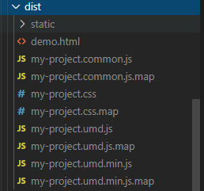

# 搭建 UI 库


## 规划目录结构

### 创建项目
- 安装 `vue-cli3`，执行命令 `vue create vue-ui`，创建一个空项目

### 调整目录
```js
...
|-- examples      // 新增 examples 用于示例展示
|-- packages      // 新增 packages 用于编写存放组件
...
```

## 配置项目
通过上一步的目录改造后，会遇到两个问题。  
1. 新增`examples`示例不能运行
2. 新增`packages`目录，该目录未加入`webpack`编译

**注：cli3 提供一个可选的 `vue.config.js` 配置文件。如果这个文件存在则他会被自动加载，所有的对项目和`webpack`的配置，都在这个文件中。**

### 解决第一个问题
- 新建 `vue.config.js`
- 使用 `vue.config.js` 中的 `pages` 选项构建一个多页面的应用，将入口修改到`examples`
```js
module.exports = {
  // 修改 pages 入口
  pages: {
    index: {
      // page 的入口
      entry: 'examples/main.js',
      // 模板来源
      template: 'public/index.html',
      // 在 dist/index.html 的输出
      filename: "index.html" // 输出文件
    }
  },
};
```
### 解决第二个问题
- `packages` 是我们新增的一个目录，默认是不被 `webpack` 处理的，所以需要添加配置对该目录的支持。
- `chainWebpack` 是一个函数，会接收一个基于 `webpack-chain` 的 `ChainableConfig` 实例。允许对内部的 `webpack` 配置进行更细粒度的修改。
```js
const path = require("path");
module.exports = {
  // 修改 pages 入口
  pages: {
    index: {
      // page 的入口
      entry: 'examples/main.js',
      // 模板来源
      template: 'public/index.html',
      // 在 dist/index.html 的输出
      filename: "index.html" // 输出文件
    }
  },
  // 扩展 webpack 配置
  chainWebpack: config => {
    // @ 默认指向 src 目录，这里要改成 examples
    // 另外也可以新增一个 ~ 指向 packages
    config.resolve.alias
      .set("@", path.resolve("examples"))
      .set("~", path.resolve("packages"));

    // 把 packages 和 examples 加入编译，因为新增的文件默认是不被 webpack 处理的
    config.module
      .rule("js")
      .include.add(/packages/)
      .end()
      .use("babel")
      .loader("babel-loader")
      .tap(options => {
        // 修改它的选项...
        return options;
      });
  }
};
```

## 编写组件

### 创建组件
1. 在 `packages` 目录下，所有的单个组件都以文件夹的形式存储，所有这里创建一个目录 `button`
2. 在 `button` 目录下创建 `src/main.vue` 存储组件源码 
3. 在 `button` 目录下创建 `index.js` 文件对外提供对组件的引用。

- `button/src/main.vue` 文件
```vue
<template>
  <button class="ei-button" @click="handleClickBtn">
    <slot>按钮</slot>
  </button>
</template>

<script>
export default {
  name: "ZuiButton",
  methods: {
    handleClickBtn() {
      this.$emit("click");
    }
  }
};
</script>
<style>
.ei-button {
  color: #fff;
  font-size: 16px;
  line-height: 1;
  margin: 0;
  border: none;
  padding: 16px 20px;
  background: #4a4c5b;
  border-radius: 2px;
  cursor: pointer;
  outline: none;
  box-sizing: border-box;
}
</style>
```
- `button/index.js`
```js
// 导入组件
import Button from "./src/main";

// 为组件提供 install 安装方法，供按需引入
Button.install = function(Vue) {
  Vue.component(Button.name, Button); // 组件必须声明 name 属性，相当于唯一表示
};
// 导出组件
export default Button;
```

### 导出组件
1. 将 `src` 目录下的文件删除，新建 `index.js` 文件，对整个组件库进行导出。

- `src/index.js`
```js
import Button from '../packages/button/index.js';

const components = [
  Button,
]

const install = function (Vue) {
  components.forEach(component => Vue.use(component));
};

if (typeof window !== 'undefined' && window.Vue) {
  install(window.Vue);
}

export default {
  version: '0.0.1',
  install,
  Button
};
```


### 编写示例
1. 在`examples`目录下新建`main.js`来导入组件并注册
- `examples/main.js`
```js
import Vue from "vue";
import App from "./App.vue";

// 导入组件
import Zui from '../src'
// 注册组件
Vue.use(Zui)

Vue.config.productionTip = false;

new Vue({
  render: h => h(App)
}).$mount("#app");

```

2. 在`examples`目录下新建`App.vue`来调用组件
- `examples/App.vue`
```vue
<template>
  <div id="app">
    <zui-button @click="handleClick">点击我</zui-button>
  </div>
</template>

<script>
export default {
  name: "App",
  methods: {
    handleClick() {
      console.log("被点击了");
    }
  }
};
</script>
```


## 发布 `NPM`

1. `package.json` 中新增一条**编译为库**的命令
在库模式中，Vue是外置的，这意味着即使在代码中引入了 Vue，打包后的文件也是不包含Vue的，减小体积。
[官方文档介绍](https://cli.vuejs.org/zh/guide/build-targets.html#库)

**在 scripts 中新增一条命令 `npm run lib`**
- `--target`：构建目标，默认为应用模式。这里修改为 `lib` 启用库模式。
- `--name`: 输出文件名
- `--dest`：输出目录，默认 `dist`。也可以改为别的
- `[entry]`：最后一个参数为入口文件，默认为 `src/App.vue`。这里我们指定编译 `packages/` 组件库目录。
```json
"scripts": {
  "lib": "vue-cli-service build --target lib --name vue-ui --dest dist src/index.js"
}
```

2. 执行编译库命令
```js
npm run lib
```
- 会在根目录生成一个 `dist` 目录。关于生成的目录官方有着详细的描述。[官方介绍](https://cli.vuejs.org/zh/guide/build-targets.html#库)

  


3. 配置 `package.json` 文件中发布到 `npm` 的字段
- `name`: 包名，该名字是唯一的。可在 npm 官网搜索名字，如果存在则需换个名字。
- `version`: 版本号，每次发布至 npm 需要修改版本号，不能和历史版本号相同。
- `description`: 描述。
- `main`: 入口文件，该字段需指向我们最终编译后的包文件。
- `keyword`：关键字，以空格分离希望用户最终搜索的词。
- `author`：作者
- `private`：是否私有，需要修改为 false 才能发布到 npm
- `license`： 开源协议
```json
  "name": "vue-ui",
  "version": "0.1.0",
  "description": "基于 vue-cli3 的 UI 组件库",
  "main": "dist/vue-ui.umd.min.js",
  "keyword": "zui vue-ui",
  "private": false,
  "license": "MIT"
```

4. 添加 `.npmignore` 文件，设置忽略发布文件，内容和 `.gitignore` 差不多  
只有编译后的 `dist` 目录、`package.json`、`README.md`才需要发布到 `npm` 上
```
# 忽略目录
examples/
packages/
public/

# 忽略指定文件
vue.config.js
babel.config.js
*.map
```

5. 登录到`npm`
- 首先需要到 `npm` 上注册一个账号，注册过程略。
- 如果配置了淘宝镜像，先设置回 `npm` 镜像：
```
npm config set registry http://registry.npmjs.org 
```
- 终端执行登录命令，输入用户名、密码、邮箱即可登录。
```
npm login
```

6. 发布到 npm
执行发布命令，发布组件到 npm
```
npm publish
```

7. 登录 `npm` 账号查看是否发布成功，发布成功后就可以在新项目中安装使用了


## 按需加载
### 方式
- 使用[`babel-plugin-import`](https://github.com/ant-design/babel-plugin-import)、[`babel-plugin-component`](https://github.com/ElementUI/babel-plugin-component)插件来自动按需引入。[两者的区别](https://segmentfault.com/q/1010000022005673)
- 提供`es module`版本，开启`tree shaking`


### babel-plugin-import
- 原理
```js
import { Button, Icon } from 'element-ui'
//  会转化为
const Button = require('element-ui/lib/button.js')
require('element-ui/theme-chalk/button.css')

const Icon = require('element-ui/lib/icon.js')
require('element-ui/theme-chalk/icon.css')
```

### 添加测试的组件
1. 新增一个`text`组件
```vue
<!-- text/src/main.vue -->
<template>
  <p class="zui-text">
    <slot>文本组件</slot>
  </p>
</template>

<script>
export default {
  name: "ZuiText"
};
</script>
<style>
.zui-text {
  color: #fc9153;
  font-weight: 700;
  font-size: 16px;
}
</style>
```
```js
// text/index.js
import Text from "./src/main";
Text.install = function (Vue) {
  Vue.component(Text.name, Text);
};
export default Text;
```


2. 新增一个`element`组件，引入`element-ui`，这样的话引入全部组件时体积就会变大，按需引入`button、text`组件时体积就会缩小  
- `npm install -S element-ui`
```js
// element/index.js
import Element from 'element-ui'
import 'element-ui/lib/theme-chalk/index.css'
export default {
  install(Vue) {
    Vue.use(Element)
  }
}
```

3. `packages`的目录结构
```
- packages
  - button
      - src
        - main.vue
      - index.js
  - text
      - src
        - main.vue
      - index.js
  - element
      - index.js
```

### 引入组件
1. 修改`src/index.js`
```js
import Button from '../packages/button/index.js';
import Text from '../packages/text/index.js';
import Element from '../packages/element/index.js';

const components = [
  Button,
  Text,
  Element
]

const install = function (Vue) {
  components.forEach(component => Vue.use(component));
};

if (typeof window !== 'undefined' && window.Vue) {
  install(window.Vue);
}

export default {
  version: '0.0.1',
  install,
  ...components
};
```

2. 修改`examples/App.vue`示例代码
```vue
<template>
  <div id="app">
    <zui-button @click="handleClick">按钮组件</zui-button>
    <zui-text>文本组件</zui-text>
    <el-button type="primary">Element 按钮</el-button>
  </div>
</template>

<script>
export default {
  name: "App",
  methods: {
    handleClick() {
      console.log("被点击了");
    }
  }
};
</script>
```

### 新增配置
1. 新增`build`目录，在目录下创建`utils.js`、`config.pub.js`、`config.dev.js`、`config.build.js`四个文件
```
- build
  - utils.js
  - config.pub.js
  - config.dev.js
  - config.build.js
```

- `utils.js`：工具函数获取组件地址
```js
// build/utils.js
const fs = require('fs')
const path = require('path')
const join = path.join

const resolve = (dir) => join(__dirname, '../', dir)
const index = path.resolve(__dirname, '../', 'src/index.js')

module.exports = {
  resolve,
  getComponentEntries(path) {
    let files = fs.readdirSync(resolve(path));
    const componentEntries = files.reduce((ret, item) => {
      const itemPath = join(path, item)
      const isDir = fs.statSync(itemPath).isDirectory();
      if (isDir) {
        ret[item] = resolve(join(itemPath, 'index.js'))
      } else {
        const [name] = item.split('.')
        ret[name] = resolve(`${itemPath}`)
      }
      return ret
    }, {})
    // idnex 文件包含所有的组件
    componentEntries['index'] = index;
    console.log(componentEntries)
    return componentEntries
  },
}
```

- `config.pub.js`：开发调试 和 打包构建 共有的配置
```js
// build/config.pub.js
const utils = require('./utils')
module.exports = {
  resolve: {
    extensions: ['.js', '.vue', '.json'],
    alias: {
      'src': utils.resolve('src'),              
      'packages': utils.resolve('packages'),  
    }
  },
}
```
- `config.dev.js`：开发调试 配置
```js
// build/config.dev.js
const pub = require('./config.pub')
module.exports = {
  pages: {
    index: {
      // page 的入口
      entry: 'examples/main.js',
      // 模板来源
      template: 'public/index.html',
      // 在 dist/index.html 的输出
      filename: "index.html" // 输出文件
    }
  },
  configureWebpack: {
    resolve: pub.resolve
  },
  chainWebpack: config => {
    config.module
      .rule("js")
      .include.add(/packages/)
      .end()
      .use("babel")
      .loader("babel-loader")
      .tap(options => {
        return options;
      });
  }
}
```
- `config.build.js`：打包构建 配置
```js
// build/config.build.js
const { resolve, getComponentEntries } = require('./utils')
const pub = require('./config.pub')

module.exports = {
  outputDir: resolve('lib'),
  configureWebpack: {
    entry: getComponentEntries('packages'),
    output: {
      filename: '[name]/index.js',
      libraryTarget: 'umd', // 兼容性最好，可以在CommonJS, AMD环境下运行
      libraryExport: 'default',
      library: 'vue-ui',
    },
    resolve: pub.resolve,
  },
  css: {
    sourceMap: true,
    extract: {
      filename: '[name]/style.css'
    }
  },
  chainWebpack: config => {
    config.optimization.delete('splitChunks')
    config.plugins.delete('copy')
    config.plugins.delete('preload')
    config.plugins.delete('prefetch')
    config.plugins.delete('html')
    config.plugins.delete('hmr')
    config.entryPoints.delete('app')
    config.module
      .rule('fonts')
      .use('url-loader')
      .tap(option => {
        option.fallback.options.name = 'static/fonts/[name].[hash:8].[ext]'
        return option
      })
  }
}
```
- 修改`vue.config.js`文件
```js
const devConfig = require('./build/config.dev')
const buildConfig = require('./build/config.build')
module.exports = process.env.NODE_ENV === 'development' ? devConfig : buildConfig
```

- 执行 `npm run build`  
  


### 测试按需加载
- 在`UI 框架`根目录执行`npm link`将包添加到全局。或者从`NPM`上安装包[npm link介绍](https://www.jianshu.com/p/aaa7db89a5b2)
- 新建一个`test-ui`项目来测试
```html
<!-- 新建一个测试项目 -->
vue create test-ui
<!-- 将 测试项目 和 UI框架 之间建立链接 -->
npm link vue-ui
```

1. 没有引入组件时  

  


2. 组件全部引入
```js
import ZuiVueUi from 'vue-ui'
import 'vue-ui/lib/index/style.css';
Vue.use(ZuiVueUi)
```
 

3. 组件按需引入
- 安装`babel-plugin-import`。`npm i -D babel-plugin-import`
- 修改`babel.config.js`文件。**修改后组件就不能全量引入了**
```js
// babel.config.js
module.exports = {
  presets: ["@vue/cli-plugin-babel/preset"],
  plugins: [
    [
      "import",
      {
        libraryName: "vue-ui",
        style: (name) => {
          console.log(name)
          return `${name}/style.css`;
        }
      }
    ]
  ]
};
```
- 按需引入`button、text`组件
```js
import { Button, Text } from 'vue-ui'
Vue.use(Button)
Vue.use(Text)
```
 


## 组件文档

###  安装 VuePress
- 详细配置前往官网查看。[VuePress 官方文档](https://vuepress.vuejs.org/zh/guide/getting-started.html#%E7%8E%B0%E6%9C%89%E9%A1%B9%E7%9B%AE)
```sh
# 将 VuePress 作为一个本地依赖安装
yarn add -D vuepress # 或者：npm install -D vuepress

# 新建一个 docs 文件夹
mkdir docs
```

- 在 `docs` 目录新建 `README.md` 文件
```markdown
---
home: true
heroImage: /hero.png
actionText: 开始阅读 →
actionLink: /web/
features:
- title: 简洁至上
  details: 以 Markdown 为中心的项目结构，以最少的配置帮助你专注于写作。
- title: Vue驱动
  details: 享受 Vue + webpack 的开发体验，在 Markdown 中使用 Vue 组件，同时可以使用 Vue 来开发自定义主题。
- title: 高性能
  details: VuePress 为每个页面预渲染生成静态的 HTML，同时在页面被加载的时候，将作为 SPA 运行。
footer: MIT Licensed | Copyright © 2018-present Evan You
---
```

- 接着，在 `package.json` 里加一些脚本
```json
{
  "scripts": {
    ...
    "docs:dev": "vuepress dev docs",
    "docs:build": "vuepress build docs"
  }
}
```
- 运行项目
```sh
npm run docs:dev
```


## 参考文献
- [Vue cli3 库模式搭建组件库并发布到 npm](http://www.rxshc.com/180.html)
- [Vue组件库实现按需加载功能](https://blog.csdn.net/mate_ge/article/details/100076288#vuecli3_328)
- [babel-plugin-import 和 tree shaking 的区别](https://juejin.im/post/5d2c248151882556d1683363)
- [tree shaking官方](https://www.webpackjs.com/guides/tree-shaking/)
- [tree shaking使用](https://segmentfault.com/a/1190000019220154)
- [用 vuepress 写文档](https://juejin.im/post/5e410488f265da572017de91#heading-3)
