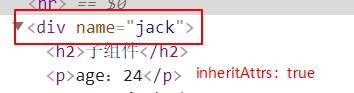
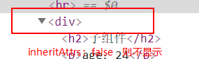

# 通信方式

## props 和 $emit

- 这种通信方式是使用的最多的一种通信方式，不过需要注意的是，`props`是以**单向数据流**的形式来完成数据的传递的

- 单项数据流：简单理解就是`props`里的数据只能由父组件改变更新向下流动到子组件，而子组件则不能修改`props`里面的数据。[Vue官网解释](https://cn.vuejs.org/v2/guide/components-props.html)

- **父组件**
``` vue
<template>
  <div>
    <h1>父组件</h1>
    <p>子组件的值：{{childData}}</p>
    <hr>
    <!-- 
      传递 message 数据给子组件，子组件用 props 接收
      监听子组件的 change-data 方法
    -->
    <child :message="message" @change-data="getChildData"></child>
  </div>
</template>
<script>
import child from './child.vue'
export default {
  components: { child },
  data() {
    return {
      message: 'hello',
      childData: ''
    };
  },
  methods: {
    getChildData(val) {
      // val 是子组件 change-data 附带的参数
      this.childData = val;
    }
  }
};
</script>

```

- **子组件**
``` vue
<template>
  <div>
    <h2>子组件</h2>
    <button @click="changeData">传值给父组件</button>
    <p>父组件的值：{{message}}</p>
  </div>
</template>
<script>
export default {
  // 用 props 接收父组件传递过来的值
  props: {
    message: {
      type: String
    }
  },
  methods: {
    changeData() {
      // 通过 $emit 触发 change-data 事件，附加参数都会传给监听回调
      // 自定义事件的命名建议使用 my-event 而不是 myEvent 这种驼峰形势 
      this.$emit('change-data', '需要传递给父组件的值')
    }
  }
};
</script>
```

- **根据以上代码得知：**
  - 父传子：用`v-bind`(简写`:`)，子组件用`props`接收
  - 子传父：用`$emit('eventName','数据')`，父组件通过监听`eventName`，触发回调来获取数据
  - 关于自定义事件命名格式问题，[Vue官网解释](https://cn.vuejs.org/v2/guide/components-custom-events.html#%E4%BA%8B%E4%BB%B6%E5%90%8D)

  
- **参考**
  - [prop](https://cn.vuejs.org/v2/guide/components-props.html)
  - [$emit](https://cn.vuejs.org/v2/api/#vm-emit)

<br>


## v-model
[查看另一篇文章v-model](/basic/vue/vue-2.html)

<br>

## .sync 修饰符
用`update:myPropName`的模式来对`prop`进行“双向绑定”，其实跟`v-model`一样也是一种语法糖的形式
- **父组件**
```vue
<template>
  <div>
    <h1>父组件</h1>
    <p>inputVal：{{inputVal}}</p>
    <hr>
    <child :title.sync="inputVal"></child>
    <!-- 实现原理 -->
    <!-- <child :title="inputVal" @update:title="inputVal=$event"></child> -->
  </div>
</template>
<script>
import child from './child'
export default {
  components: { child },
  data() {
    return {
      inputVal: 'hello'
    };
  },
};
</script>

```


- **子组件**
```vue
<template>
  <div>
    <h2>子组件</h2>
    <button @click="setData">修改父组件传递的数据</button>
    <p>父组件传递的值：{{title}}</p>
  </div>
</template>
<script>
export default {
  props: {
    title: {
      type: String
    }
  },
  methods: {
    setData() {
      this.$emit('update:title', '修改后的数据')
    }
  }
};
</script>
```
- **根据以上代码得知：**
  - 父组件用`.sync`修饰符的方式给子组件传递了`title`，子组件只需要调用`$emit('update:title', '修改后的数据')`就能修改父组件的数据

- **跟`v-model`的比较**
  - 相同：两者的本质都是语法糖，内部都是基于`v-on`跟`$emit`来实现的，并且在实现数据“双向绑定”的同时还保证了数据的正确单向流动
  - 不同：`.sync`语义上更明确，而且可以绑定多个`prop`，v-model只能绑定一个
  ```vue
  <!-- v-model 只能绑定一个 prop -->
  <child v-model="inputVal"></child>
  <!-- .sync 可以绑定多个 prop -->
  <child :title.sync="inputVal" :name.sync="name"></child>
  ```

- **参考**
  - [.sync修饰符](https://cn.vuejs.org/v2/guide/components-custom-events.html#sync-%E4%BF%AE%E9%A5%B0%E7%AC%A6)

<br>

## $attrs 和 $listeners
- API 的理解
  - $attrs：包含了父作用域中不作为 prop 被识别 (且获取) 的特性绑定，可以通过 v-bind="$attrs" 传入内部组件。[参考$attrs](https://cn.vuejs.org/v2/api/#vm-attrs)

  - $listeners：包含了父作用域中的 (不含 .native 修饰器的) v-on 事件监听器。可以通过 v-on="$listeners" 传入内部组件。[参考$listeners](https://cn.vuejs.org/v2/api/#vm-listeners)
  
  - inheritAttrs：在标签中是否显示没被 props 接收的 prop，false为不显示，默认为true，假设父组件给子组件传递了两个prop（age跟name），但是子组件在`props`中只接收了`age`,那么`name`就会子组件的根标签上显示出来,但是就算`inheritAttrs: false`，`$attrs`还是能访问。[参考$inheritAttrs](https://cn.vuejs.org/v2/api/#inheritAttrs)

  
  


- **父组件**
```vue
<template>
  <div>
    <h1>父组件</h1>
    <p>age：{{age}}</p>
    <p>name：{{name}}</p>
    <hr>
    <!-- 这里的事件如果加 .native 修饰符的话，就不能用 $listeners 获取了 -->
    <child :name="name" :age="age" @change-age="changeAge" @change-name="changeName"></child>
  </div>
</template>
<script>
import child from './child.vue'
export default {
  components: { child },
  data() {
    return {
      age: 24,
      name: 'jack',
    };
  },
  methods: {
    changeAge(val) {
      this.age = val;
      console.log('change-age:' + val);
    },
    changeName(val) {
      this.name = val;
      console.log('change-name:' + val);
    }
  }
};
</script>

```
- **子组件**
```vue
<template>
  <div>
    <h2>子组件</h2>
    <p>age：{{age}}</p>
    <!-- 不能用 props 接收，也还可以用这种方式接收数据 -->
    <p>name:{{this.$attrs.name}}</p>
    <button @click="$emit('change-age','我是子组件')">传值给父组件age</button>
    <!-- 事件使用了后代组件也还能使用 -->
    <button @click="$emit('change-name','我是子组件')">传值给父组件name</button>
    <hr>
    <!-- 
      $attrs：收集父作用域中没被 props 接收的数据
      $listeners：收集父作用域 v-on 事件监听(不含 .native)，change-sex也会被放在 $listeners 里面
    -->
    <progeny v-bind="$attrs" v-on="$listeners" @change-sex="changeSex"></progeny>
  </div>
</template>
<script>
import progeny from './progeny'
export default {
  inheritAttrs: false,  // 是否显示没被 props 接收的 prop，false为不显示，默认为true
  props: {
    age: {
      type: [Number, String]
    },
    // 如果这里接收了 name ，那么 this.$attrs 就没有 name 属性了，后代组件就不能接收了（事件则没这个限制）
    // name: {
    //   type: String
    // }
  },
  components: {
    progeny
  },
  created() {
    console.log(this.$attrs)  // {name: "jack"}
    console.log(this.$listeners)  // {change-age: ƒ, change-name: ƒ}
  },
  methods: {
    changeSex(val) {
      console.log(val);
    }
  }
};
</script>
```
- **后代组件**
```vue
<template>
  <div>
    <h3>后代组件</h3>
    <p>name：{{name}}</p>
    <!-- 为空了 -->
    <!-- <p>name：{{this.$attrs.name}}</p> -->
    <button @click="$emit('change-age','我是后代组件')">传值给祖先组件age</button>
    <button @click="$emit('change-name','我是后代组件')">传值给祖先组件name</button>
    <button @click="$emit('change-sex','我是后代组件')">传值给 child 组件 sex</button>
  </div>
</template>
<script>
export default {
  props: {
    // 这里只要接收了，this.$attrs 就没有 name 属性了
    name: {
      type: String
    }
  },
  created() {
    console.log(this.$attrs)  // { }  因为已经被 props 接收了，所以里面没数据了
    console.log(this.$listeners)  // {change-sex: ƒ, change-age: ƒ, change-name: ƒ}
  }
};
</script>
```
- **根据以上代码得知：**
  - 假设父组件为 `A`，子组件为 `B`，后代组件为`C`
  - `A` 组件给 `B` 组件传递了两个`prop`（name跟age），监听了两个事件（change-age跟change-name）
  - `B` 组件用`props`接收了`age`数据，但没有接收`name`数据，那么这时候`name`数据就被包含在`$attrs`中，通过`v-bind="$attr"`来传给 `C` 组件
  - 并且用`v-on="$listeners"`（change-age跟change-name）将父组件中的事件监听也传给 `C` 组件了，而且还加了一个`change-name`，那么这时候 `C` 组件的`$listeners`就有三个方法了
  - `C` 组件则用`$emit(事件名,数据)`来触发相应的事件

- **注意**
  - `$attrs`中只包含不被`props`获取的值，也就是说如果中途用`props`获取了，那么后代组件的`$attrs`里就没有这个属性了，事件则没这个限制，就算中途被执行了后代组件也可以执行


- **参考**
  - [$attrs](https://cn.vuejs.org/v2/api/#vm-attrs)
  - [$listeners](https://cn.vuejs.org/v2/api/#vm-listeners)
  - [$inheritAttrs](https://cn.vuejs.org/v2/api/#inheritAttrs)

<br>

## provide 和 inject
类似与`React`的`Context API`

在父组件中通过 `provide` 来提供属性，然后在子组件中通过 `inject` 来注入变量。不论子组件有多深，只要调用了 inject 那么就可以注入在 `provide` 中提供的数据，而不是局限于只能从当前父组件的 `prop` 属性来获取数据，只要在父组件的生命周期内，子组件都可以调用

- **父组件**
```vue
<template>
  <div>
    <h1>父组件</h1>
    <p>age：{{age}}</p>
    <hr>
    <child :age="age"></child>
  </div>
</template>
<script>
import child from './child.vue'
export default {
  components: { child },
  provide() {
    return {
      message: this.name,
      // 也可以传入一个函数
      changeAge: this.changeAge
    }
  },
  data() {
    return {
      age: 24,
      name: 'jack',
    };
  },
  methods: {
    changeAge(val) {
      this.age = val;
    }
  }
};
</script>

```
- **子组件**
```vue
<template>
  <div>
    <h2>子组件</h2>
    <p>age：{{age}}</p>
    <hr>
    <progeny></progeny>
  </div>
</template>
<script>
import progeny from './progeny'
export default {
  props: {
    age: {
      type: [Number, String]
    },
  },
  components: {
    progeny
  },
};
</script>
```
- **后代组件**
```vue
<template>
  <div>
    <h3>后代组件</h3>
    <p>message：{{message}}</p>
    <!-- 直接执行祖先元素的 changeAge 事件 -->
    <button @click="changeAge('祖先元素 age 被修改了')">修改 age</button>
  </div>
</template>
<script>
export default {
  // 用 inject 获取祖先组件的 provide
  inject: ['message', 'changeAge'],
};
</script>
```

- **根据以上代码得知：**
  1. 在父组件中用`provide`提供了`message`和`changeAge`属性，值分别是`this.name`数据跟`this.changeAge`事件
  2. 在后代组件中可以用`inject`获取使用 

- **注意**
  1. `provide` 和 `inject` 绑定并不是可响应的。但如果你传入了一个可监听的对象，那么其对象的属性还是可响应的。


- **参考**
  - [provide / inject](https://cn.vuejs.org/v2/api/#provide-inject)
  


<br>


## $parent 和 $children
 