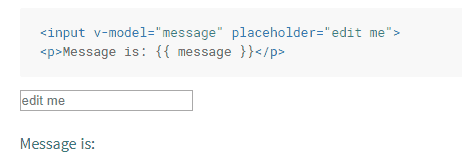
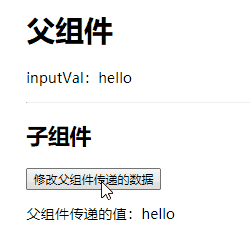

# v-model 实现原理



- [Vue 官网查看更多效果](https://cn.vuejs.org/v2/guide/forms.html)

## 实现`v-model`

```vue
<template>
  <div>
    <h1>v-model实现原理</h1>
    <!-- <input v-model="inputVal"> -->
    <input :value="inputVal" @input="inputVal = $event.target.value" />
    <p>{{ inputVal }}</p>
  </div>
</template>
<script>
export default {
  data() {
    return {
      inputVal: "hello"
    };
  }
};
</script>
```

- **根据以上代码得知**

  - `v-model`实际上是一个语法糖，首先将 inputVal 作为响应式数据，然后监听 input 的 input 事件并将 inputVal 的值赋值成自己的 value 属性

- `v-model`会忽略所有表单元素的`value`、`checked`、`selected`特性的初始值而总是将`Vue`实例的数据作为数据来源。
- `v-model` 在内部为不同的输入元素使用不同的属性并抛出不同的事件：
  - text 和 textarea 元素使用 `value` 属性和 `input` 事件；
  - checkbox 和 radio 使用 `checked` 属性和 `change` 事件；
  - select 字段将 value 作为 `prop` 并将 `change` 作为事件。

* **参考**
  - [表单输入绑定](https://cn.vuejs.org/v2/guide/forms.html#%E5%9F%BA%E7%A1%80%E7%94%A8%E6%B3%95)

<br>

## 组件上使用`v-model`

建议首先了解[props 跟\$emit](/basic/vue/vue-1.html#props-和-emit)



- **父组件**

```vue
<template>
  <div>
    <h1>父组件</h1>
    <p>inputVal：{{ inputVal }}</p>
    <hr />
    <child v-model="inputVal"></child>
    <!-- 实现原理 -->
    <!-- <child :value="inputVal" @input="inputVal=$event"></child> -->
  </div>
</template>
<script>
import child from "./child";
export default {
  components: { child },
  data() {
    return {
      inputVal: "hello"
    };
  }
};
</script>
```

- **子组件**

```vue
<template>
  <div>
    <h2>子组件</h2>
    <button @click="setData">修改父组件传递的数据</button>
    <p>父组件传递的值：{{ value }}</p>
  </div>
</template>
<script>
export default {
  props: {
    value: {
      type: String
    }
  },
  methods: {
    setData() {
      this.$emit("input", "修改后的数据");
    }
  }
};
</script>
```

- **根据以上代码得知：**
  1. 在子组件上使用`v-model`时，会传给子组件一个名为`value`的`prop`
  2. 监听子组件的`input`事件
  3. 当子组件的`input`事件触发并带有新值时，将新的值赋值给`inputVal`，从而实现双向绑定的效果

<br>

## 深入`v-model`

当在自定义组件上使用`v-model`时，会默认传递名为`value`的`prop`跟监听名为`input`的事件，如果想修改默认的`prop`跟`input`事件，那该怎么修改呢？

- **父组件**

```vue
<template>
  <div>
    <h1>父组件</h1>
    <p>inputVal：{{ inputVal }}</p>
    <hr />
    <child v-model="inputVal"></child>
    <!-- 实现原理 -->
    <!-- <child :message="inputVal" @custom-event="inputVal=arguments[0]"></child> -->
  </div>
</template>
<script>
import child from "./child";
export default {
  components: { child },
  data() {
    return {
      inputVal: "hello"
    };
  }
};
</script>
```

- **子组件**

```vue
<template>
  <div>
    <h2>子组件</h2>
    <button @click="setData">修改父组件传递的数据</button>
    <p>父组件传递的值：{{ message }}</p>
  </div>
</template>
<script>
export default {
  model: {
    prop: "message",
    event: "custom-event"
  },
  props: {
    // 不再绑定 value ,而是绑定自定义的 prop (message)
    message: {
      type: String
    }
  },
  methods: {
    setData() {
      // 使用自定义的事件,而不是 input 事件
      this.$emit("custom-event", "修改后的数据");
    }
  }
};
</script>
```

- **根据以上代码得知：**
  1. 子组件中的`model`选项可以自定义`props`跟事件
  2. 当用`model`选项自定义后,`props`里的`prop`跟`$emit`触发的事件名也必须跟着变化
  3. 父组件不需要任何改变

* **参考**
  - [自定义组件的`v-model`](https://cn.vuejs.org/v2/guide/components-custom-events.html#%E8%87%AA%E5%AE%9A%E4%B9%89%E7%BB%84%E4%BB%B6%E7%9A%84-v-model)
